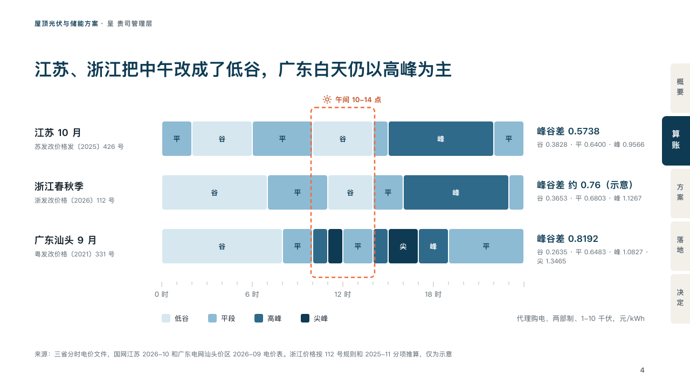

# hours

A day's tariff bands place by place, with the hours a proposal is about framed.

Code: [`src/layouts/compositions/hours.tsx`](../../../src/layouts/compositions/hours.tsx). The header comment there is the contract. The binder setting only.

## proposal, rooftop solar and storage proposal sample, 2026-10

Settled on the tariff hours page (p04). The round's decisions are in [rounds/2026-10-06-proposal](../../rounds/2026-10-06-proposal/README.md).

| board (p04) | engine |
| :-: | :-: |
|  |  |

**What it looks like.** A row a place: its name at 18px bold over the document it rests on in small grey, then the day as one band of runs, each run as wide as its hours and coloured by its step (the sky's tint, the sky, the second petrol, petrol), its short name written in it when the run is two hours or more, and at the right the row's figure in petrol with its prices in grey. The hours the page is about (the heat grid's band, 「午间 10-14 点」) are framed across the rows in a dashed outline of the tangerine, named over it in the darker tangerine with its icon. Under the rows the hours' ticks, a label every six hours, and a key of the steps beside the grid's note at the right.

**Why.** A tariff change is a change in when a day is cheap. Laying three places' days on one clock shows that midday moved to the off-peak in two of them, which is the whole case for re-checking a rooftop's sums.

**What it gave up.**

- Takes a `heatmap` of two or three rows, twelve to 24 columns and two to five named `steps`, its rows named "place：document", with no values printed, no axis title but `x_title` and at most one band, then a `kpi_cards` with one figure a row and no icon, unit, delta, tag, tone or source.
- Every step's short name has to print in at least one run, or the page goes back: a key that names a step the grid never shows is a key for nothing.
- The labels name columns, so a 24-hour day is labelled 0, 6, 12 and 18. The board's 「24 时」 named the end of the day, which is not a column.
- A row name or document past its column, a figure past the right column, a band name past one line or a key wider than its row sends the page back.
