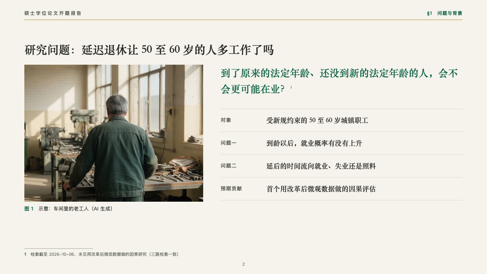

# inquiry

A research question beside its figure, with the terms it rests on.

Code: [`src/layouts/compositions/inquiry.tsx`](../../../src/layouts/compositions/inquiry.tsx). The header comment there is the contract. The manuscript setting only.

## thesis, retirement age thesis proposal sample, 2026-10

Settled on the research question page (p02). The round's decisions are in [rounds/2026-10-06-thesis](../../rounds/2026-10-06-thesis/README.md).

| board (p02) | engine |
| :-: | :-: |
|  |  |

**What it looks like.** A photograph down the left with its caption under it, numbered as the page's figure (「图 1」). At the right the question set at 26px in emerald in the heading serif, its note's superscript lit, then the terms it rests on as ruled rows: each row's name at 13px in the grey and what it says at 16px in the heading serif.

**Why.** A committee reads a proposal's question before anything else. Setting it large beside a picture of the people it is about, with its object, its two questions and its contribution under it, puts the whole study on one page.

**What it gave up.**

- Takes an `image`, a `paragraph` (the question) and a `bullets` of two to five written 「name：what it says」, in that order.
- A question past two lines, a name past 120px, a row past one line or a caption past one line sends the page back.
