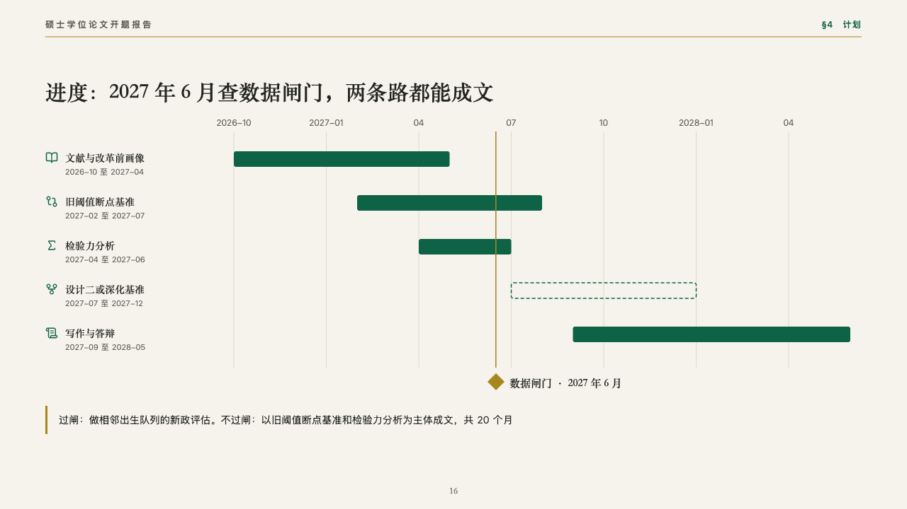

# itinerary

A schedule with the gate it turns on.

Code: [`src/layouts/compositions/itinerary.tsx`](../../../src/layouts/compositions/itinerary.tsx). The header comment there is the contract. The manuscript setting only.

## thesis, retirement age thesis proposal sample, 2026-10

Settled on the schedule (p16). The round's decisions are in [rounds/2026-10-06-thesis](../../rounds/2026-10-06-thesis/README.md).

| board (p16) | engine |
| :-: | :-: |
|  |  |

**What it looks like.** The axis's named ticks over the rows with a hairline down from each, a row a piece of work with its icon in emerald, its name in the heading serif and its stretch in words under it, and a bar of emerald along the axis, a stretch not settled drawn as a dashed outline. The moment the plan turns on is a gold line down the rows with a gold diamond under them and its name beside it. A closing line with a gold bar.

**Why.** The plan forks at the data gate. A gold line through the schedule shows which work comes before it and which depends on it.

**What it gave up.**

- Takes a `gantt` with a `range`, `axis_labels` one a unit (a blank leaves its tick unnamed), two to six rows each with an icon and a period, and one `milestones` entry, then optionally a `callout`.
- A row's name or period past its column or a closing line past one line sends the page back.
