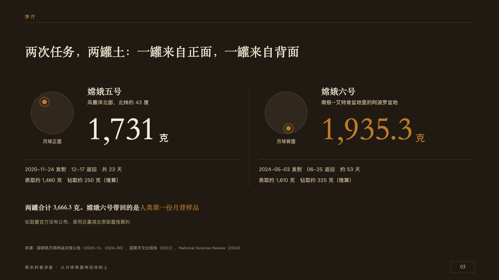
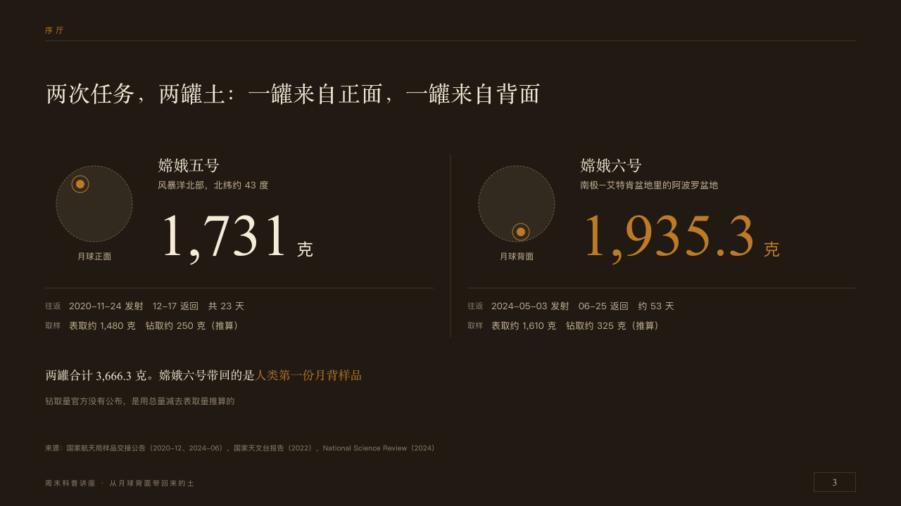

# jars

Two samples side by side, each as large as what it weighs.

Code: [`src/layouts/compositions/jars.tsx`](../../../src/layouts/compositions/jars.tsx). The header comment there is the contract. The placard setting only.

## museum, Moon soil science talk sample, 2026-10

Settled on p03. The round's decisions are in [2026-10-08-museum](../../rounds/2026-10-08-museum/README.md).

| board (p03) | engine |
| :-: | :-: |
|  |  |

**What it looks like.** The claim over the page. Two halves split by a seam from y220 to y480. In each, a specimen dish 108px across in the case's dark with a dotted rim, a copper mark and ring where the sample was taken (up and left on the first, down and right on the second), the side it stands for under it. Beside it the sample's name at 22px in the serif, where it came from at 13px in old paper, its quantity at 84px in the serif with its unit at 24px after it, the marked one in copper. Under a seam on y410 the particulars a line each, every one after its row's name small and dim. A closing line at 17px in the serif on y520, its marked run in copper, and a note at 12px in the dim under it.

**Why.** Two missions brought two jars back from two sides of the Moon: the page puts them side by side as a museum would.

**What it gave up.**

- Takes a `kpi_cards` of two (label, note and tag on each), a `comparison` whose two columns are the two labels and up to three rows, and up to two `paragraph`s.
- Each particular is set after its row's name, small and dim, which the board left off: every word the author writes is drawn.
- Where the mark stands on each dish is drawn, not measured.
