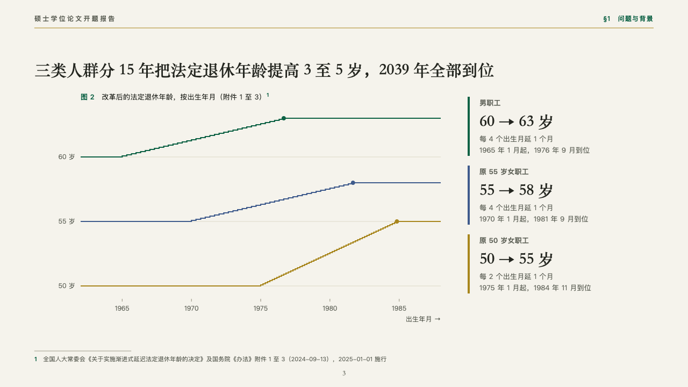
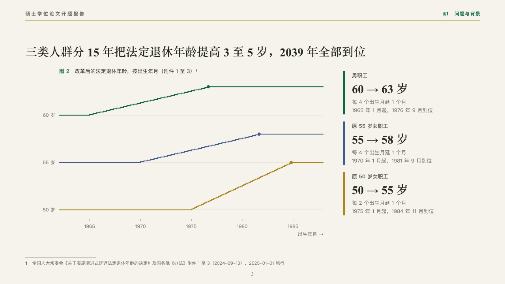

# ladder

Schedules that climb in steps, a card a schedule.

Code: [`src/layouts/compositions/ladder.tsx`](../../../src/layouts/compositions/ladder.tsx). The header comment there is the contract. The manuscript setting only.

## thesis, retirement age thesis proposal sample, 2026-10

Settled on the statutory ladder (p03). The round's decisions are in [rounds/2026-10-06-thesis](../../rounds/2026-10-06-thesis/README.md).

| board (p03) | engine |
| :-: | :-: |
|  |  |

**What it looks like.** The figure's number and title over a plot of staircases on a continuous axis (the statutory age by date of birth), one a group in emerald, indigo and gold, with a dot where each reaches its top, a hairline every five units up and a tick every five units along. At the right a card a group: a bar of its colour, its name, its range set large in the heading serif (「60 → 63 岁」) and how it climbs in two lines.

**Why.** A retirement age that rises a month every four months of birth is a staircase. Drawn as one, the three groups' different starts, paces and ends read at a glance, and the cards carry the rule in words.

**What it gave up.**

- Takes a titled `scatter` chart of one to three series joined as `steps`, then a `kpi_cards` with an item a series in the same order, each with a note.
- A card's name or range past one line or a note past two lines sends the page back.
