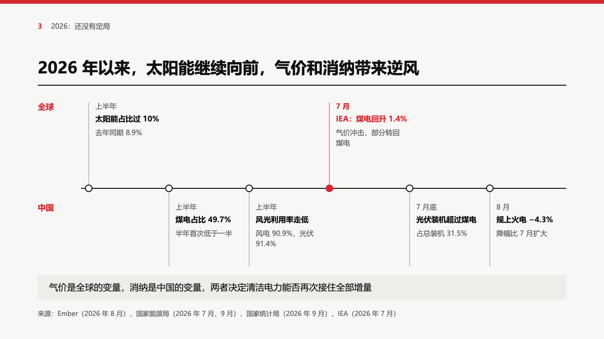
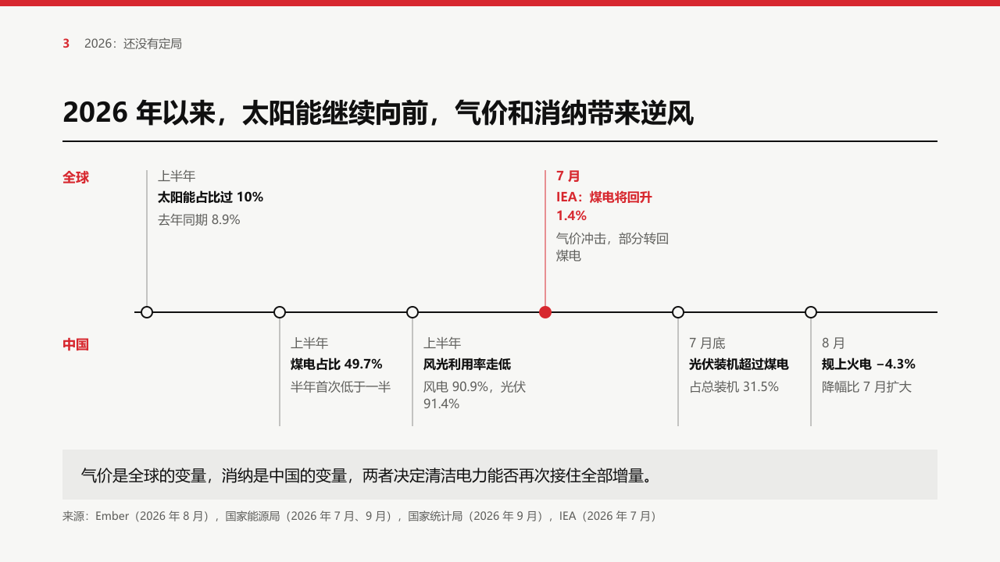

# lanes

A timeline on one axis across the page, its milestones as equal columns, the first lane's cards above the axis and the second's below it.

Code: [`src/layouts/compositions/lanes.tsx`](../../../src/layouts/compositions/lanes.tsx). The header comment there is the contract.

## bulletin, NEV sample, 2026-10

Settled on the regulation page. The round's decisions are in [rounds/2026-10-03-bulletin](../../rounds/2026-10-03-bulletin/README.md).

| board (p11) | engine |
| :-: | :-: |
|  |  |

**What it looks like.** The lane names (`timeline.lanes`, or the lanes the milestones name) sit at the left in primary bold. The axis runs across the page, and each milestone, in time order, takes an equal column: a 7px node on the axis, a thin line up or down to its card, and the card's date, bold title (two lines at most) and description (three at most), all at 16px. A highlighted milestone has a filled node and its line, date and title in primary. A closing note sits on a light panel at the foot.

**Why.** Home rules and trade rules move on one calendar, and the reader needs both the order and which side each rule is on. One axis with two sides shows both without two charts.

**What it gave up.**

- Two to eight milestones on a horizontal timeline, at most two lanes. A timeline with no lanes stands every card above the axis.
- Cards never cross the axis: the axis rises when the lower lane and the note need room, and the composition declines when it cannot.
- 16px everywhere, where the board set some lines at 15px.

## swiss, power sample, 2026-10

In the grid setting. The round's decisions are in [rounds/2026-10-03-swiss](../../rounds/2026-10-03-swiss/README.md).

| board (p12) | engine |
| :-: | :-: |
|  |  |

**What it looks like.** The lane names and the highlighted milestone (its node filled, its stem, date and title) in the accent, everything else black and grey, on a 2px black axis 204px into the band (y400). The closing note on the light panel at the foot.

**What it gave up.**

- Dates and descriptions at 16px, where the board set 15px.
- A title longer than its card wraps to a second line: 「IEA：煤电将回升 1.4%」 is one character longer than the board's and does not fit 146px at 16px bold.
- The closing note is 20px in a 64px panel, where the board drew 19px in 52px.
