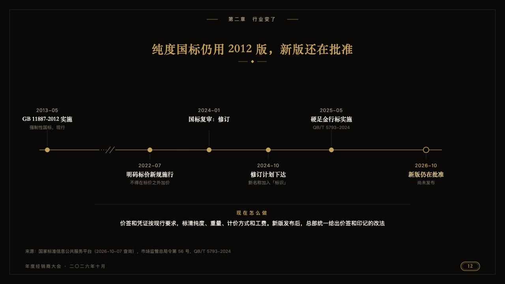
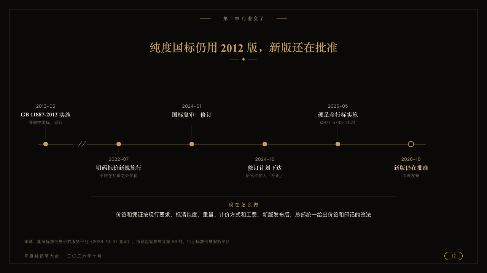

# lapse

A rule's dates on one gold hairline, the long quiet years cut short.

Code: [`src/layouts/compositions/lapse.tsx`](../../../src/layouts/compositions/lapse.tsx). The header comment there is the contract. The invitation setting only.

## luxe, gold dealer conference sample, 2026-10

Settled on p12. The round's decisions are in [2026-10-08-luxe](../../rounds/2026-10-08-luxe/README.md).

| board (p12) | engine |
| :-: | :-: |
|  |  |

**What it looks like.** The milestones stand evenly along the line, each a gold dot with its date small and tracked, its title in the ivory serif and its line under it, above and below the line in turn. A stretch far longer than the others is cut by two slanting strokes where it runs dashed. A milestone still to come is a hollow dot with its date in gold. Under a hairline across the page what to do now, its title small in gold and its words centred in ivory.

**Why.** Eleven years between a standard and its revision say nothing day to day. Cutting them short keeps the recent dates readable.

**What it gave up.**

- Takes one `timeline` across the page of three to seven milestones with no icon, tone, tag, source or lane, then optionally a `callout` with no icon or tag.
- A date, title or line wider than its place, or a callout past two lines, sends the page back.
