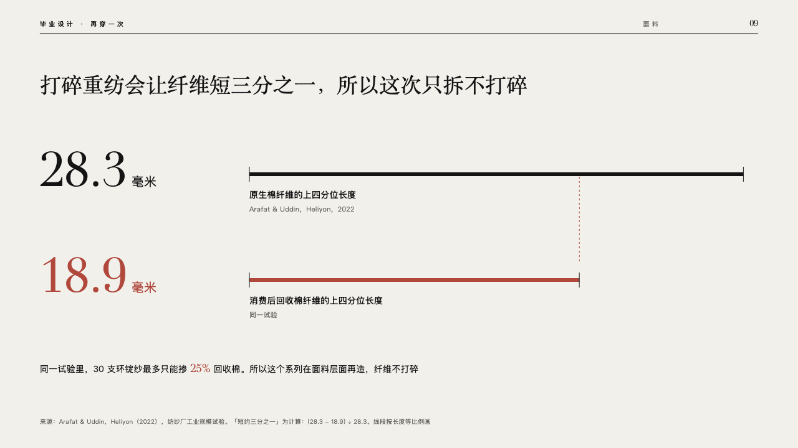
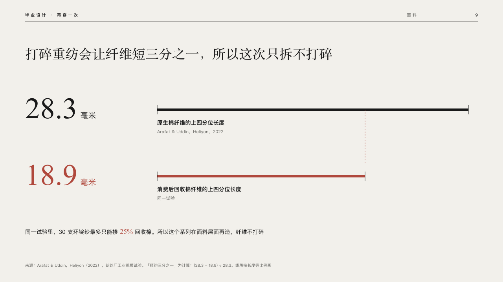

# lengths

Quantities of one unit drawn as lines to scale.

Code: [`src/layouts/compositions/lengths.tsx`](../../../src/layouts/compositions/lengths.tsx). The header comment there is the contract. The lineup setting only.

## runway, graduation collection review sample, 2026-10

Settled on p09. The round's decisions are in [2026-10-08-runway](../../rounds/2026-10-08-runway/README.md).

| board (p09) | engine |
| :-: | :-: |
|  |  |

**What it looks like.** The claim over the page. A row a figure: the figure at 76px in the serif at the left with its unit after it, and from x400 a 6px line as long as the figure with a tick at each end, the longest running to x1192 and the others to the same scale. Under each line what it counts in bold and where it comes from small and grey. The figure that moved (`delta`) and its line are crimson, and a dashed crimson line runs from its end up to the longest line. A line of text closes the page at 14/24, its marked run in the serif in crimson.

**Why.** A fibre a third shorter is understood at a glance when the two lengths are drawn to scale.

**What it gave up.**

- Takes a `kpi_cards` of two or three plain positive numbers of one unit with labels, one of them with a `delta` up or down, then optionally a `paragraph`. Figures with no `delta` go to `duet`.
- The board marked the shorter figure by colour alone. The engine reads which one moved from its `delta`.
- A label or a source past one line, or a dashed reach that would cross words, sends the page back.
