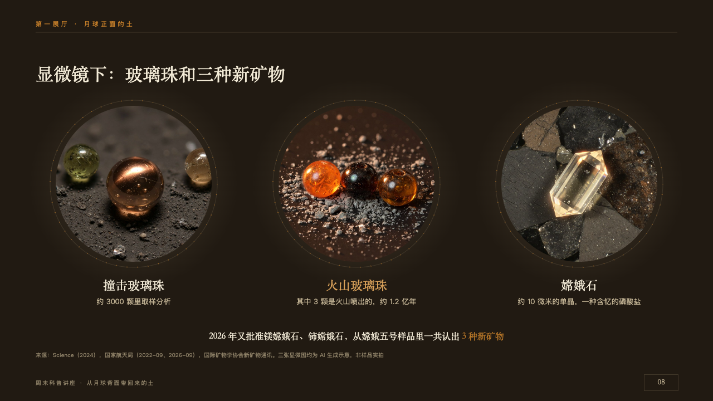
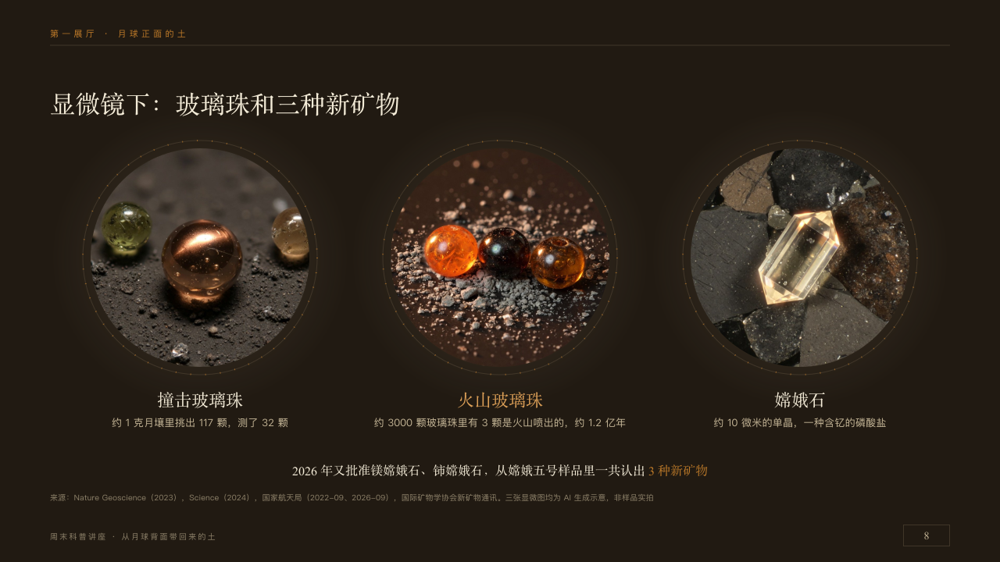

# lenses

Small exhibits seen through a microscope.

Code: [`src/layouts/compositions/lenses.tsx`](../../../src/layouts/compositions/lenses.tsx). The header comment there is the contract. The placard setting only.

## museum, Moon soil science talk sample, 2026-10

Settled on p08. The round's decisions are in [2026-10-08-museum](../../rounds/2026-10-08-museum/README.md).

| board (p08) | engine |
| :-: | :-: |
|  |  |

**What it looks like.** The claim over the page. Two to four round fields of view in a row centred on the page 400px apart, each a photograph cut round 280px across in its own pool of light, a seam round it at 150px and a copper ring of dots over the seam like a microscope's stage, the exhibit's name at 22px in the serif under it (a marked name in the lit copper) and its line at 13/22 in old paper. A closing line at 16px in the serif, centred, its marked run in copper.

**Why.** Beads and a crystal ten microns across are only seen through a lens: the page shows them that way.

**What it gave up.**

- Takes an `image_grid` of two to four captioned pictures, a `bullets` of as many lines, one under each picture, and optionally a `paragraph`.
- The dotted stage prints as PowerPoint's nearest preset dash.
