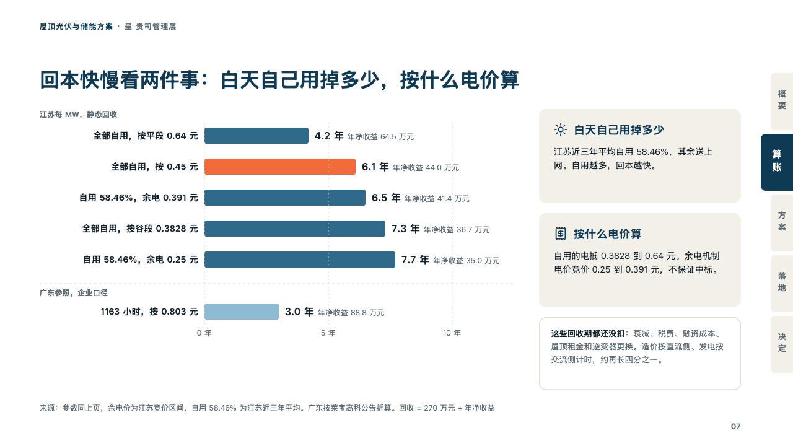
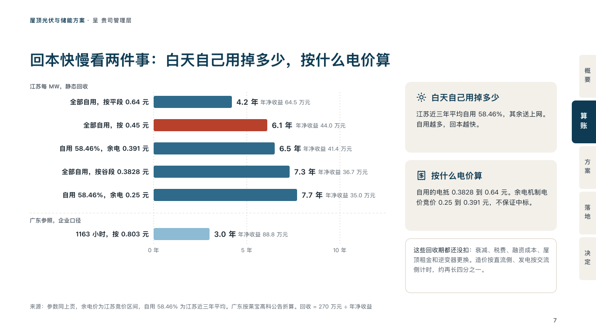

# levers

How a result moves with what it rests on: bars on their side beside the levers.

Code: [`src/layouts/compositions/levers.tsx`](../../../src/layouts/compositions/levers.tsx). The header comment there is the contract. The binder setting only.

## proposal, rooftop solar and storage proposal sample, 2026-10

Settled on the sensitivity page (p07). The round's decisions are in [rounds/2026-10-06-proposal](../../rounds/2026-10-06-proposal/README.md).

| board (p07) | engine |
| :-: | :-: |
|  |  |

**What it looks like.** At the left, bars on their side from one axis: each case right-aligned before its bar, the bars in the second petrol and the case the page rests on in the brick red, each value bold after its bar with its note in small grey. Under a dashed line a reference series in the sky. Dotted lines at the axis's round values, named under the bars with the unit. At the right a card a lever (its icon, its name in petrol, a few lines on it), and under them, in a box outlined by a hairline, what none of the figures has taken off yet, its title bold before its text.

**Why.** A payback is a range, not a number. Showing which case the proposal is read at, among the cases around it, and naming the two things that move it, is what makes the figure believable.

**What it gave up.**

- Takes a horizontal `bar` chart of one or two series (the first two to six bars with at most one marked, the second one or two), values at zero or more, notes allowed, an `icon_cards` of two with no title, tags or tone, and optionally a `callout` with no tag.
- A bar keeps the decimals the longest value was written with, so 「3.0」 does not print as 「3」.
- A case past its column, a value and note past the room after the longest bar, a card's name past one line or its text past three, or a note past four lines sends the page back.
