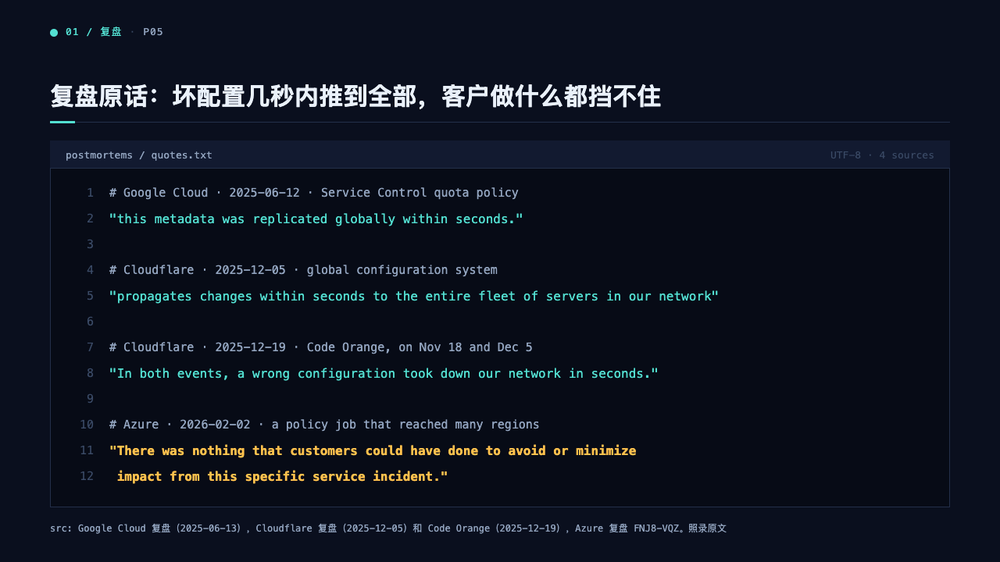
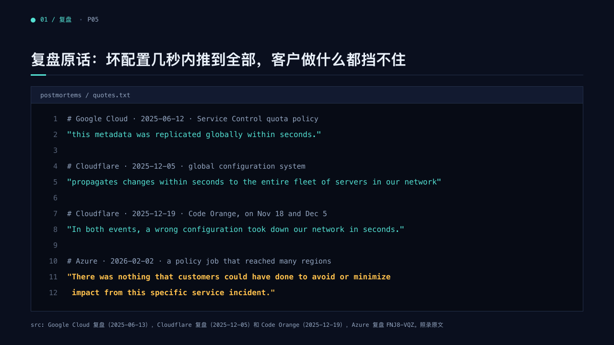

# listing

A code block as a terminal window, for quoting the exact text.

Code: [`src/layouts/compositions/listing.tsx`](../../../src/layouts/compositions/listing.tsx). The console setting only.

## terminal, cloud outage review sample, 2026-10

| board (p05) | engine |
| :-: | :-: |
|  |  |

The round's decisions are in [rounds/2026-10-05-terminal](../../rounds/2026-10-05-terminal/README.md).

**What it looks like.** A well sunk into the page inside the edge ink, under a 36px title bar on the surface that names it (`title`) in mono. Every line on a 33px pitch (down to 28px for a long listing), its number right-aligned in a gutter, its words in mono: a comment at 15px in the muted ink, a quoted line at 16px in the mark, any other line in the headline ink, and the lines the author marks (`highlight_lines`) bold in the warning ink.

**Why.** The postmortems speak in their own words, and a window with line numbers says they are quoted, not paraphrased. The ordinary code block's grey well read as a different product on the console's blue.

**What it gave up.**

- A line wider than the window, or more lines than the band holds at 28px, sends the page to the ordinary code block.
