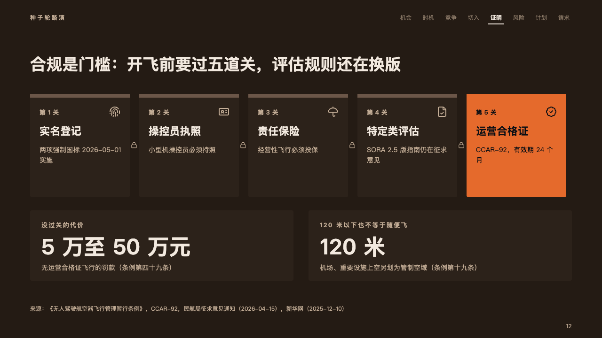

# locks

The gates a pitch must pass before it can run: a card a gate with a lock between them, the last one in the fire.

Code: [`src/layouts/compositions/locks.tsx`](../../../src/layouts/compositions/locks.tsx). The header comment there is the contract. The pitch setting only.

## ember, low-altitude delivery pitch sample, 2026-10

Settled on the compliance page (p12). The round's decisions are in [rounds/2026-10-06-ember](../../rounds/2026-10-06-ember/README.md).

| board (p12) | engine |
| :-: | :-: |
|  |  |

**What it looks like.** One card a gate in a row, 220px tall, an 8px band across its top: its number at 13px bold in the warm grey (「第 1 关」, "Gate 1") with its icon at the right, the gate's name bold at 22px in up to two lines and what it asks at 14px in up to three. A small lock between each gate and the next. The last gate, the one that opens the business, is a card of the fire with everything on it in the dark ink. Under the gates a card a figure, 150px tall: what it is at 13px tracked, the figure at 46px bold, a note under it.

**Why.** A regulated business is a sequence of permissions. Counting the gates in order, with the last one lit, shows the room exactly what the first milestone is.

**What it gave up.**

- A `chevron_process` of three to six stages, then optionally a `kpi_cards` of one to three items with no delta, tone, icon, source or tag, none marked.
- A gate's number is composed from its position in the deck's language.
- A gate's name past two lines, what it asks past three, a figure's label past one line, the figure wider than its card, or its note past one line sends the page back.
