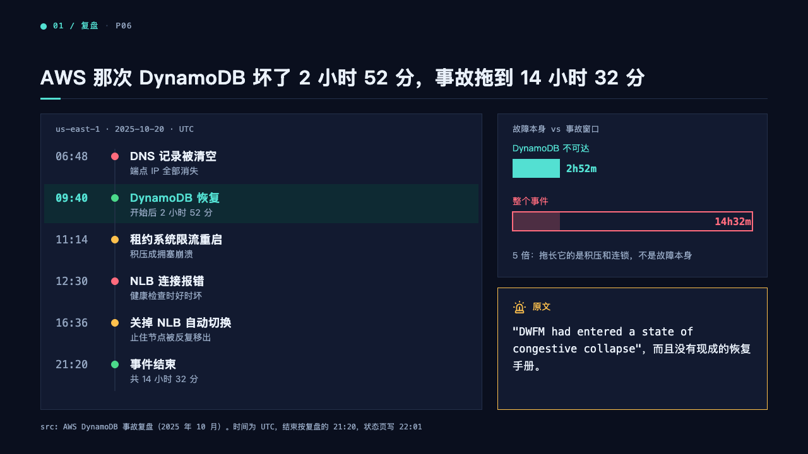
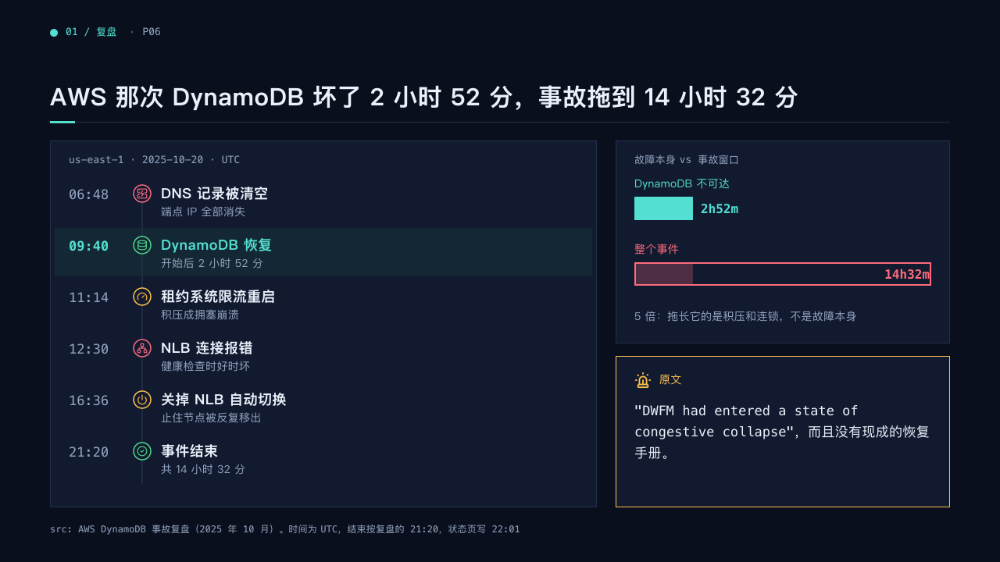

# log

A timeline set as an incident log, with a column beside it.

Code: [`src/layouts/compositions/log.tsx`](../../../src/layouts/compositions/log.tsx). The console setting only. The column beside it is drawn by whichever composition takes it, on the board [`span`](../span/).

## terminal, cloud outage review sample, 2026-10

| board (p06) | engine |
| :-: | :-: |
|  |  |

The round's decisions are in [rounds/2026-10-05-terminal](../../rounds/2026-10-05-terminal/README.md).

**What it looks like.** A panel named in mono by the timeline's `title`. Each milestone is a row 66px apart: its date in 17px mono, a dot on a rule down the panel in the milestone's `tone` (the muted ink without one), its title bold at 18px and its description at 14px. The highlighted milestone stands on the mark's tint, its date bold and its title in the mark. A milestone's `icon` replaces its dot, in a ring of the dot's ink. Up to three more components stand in a 428px column on the right.

**Why.** An incident is told by its timestamps. The dot's colour says what kind of turn each was, without competing with the one the page is about.

**What it gave up.**

- A timeline on lanes, a title or description past one line, or more milestones than the panel holds at 56px goes to the ordinary timeline.
