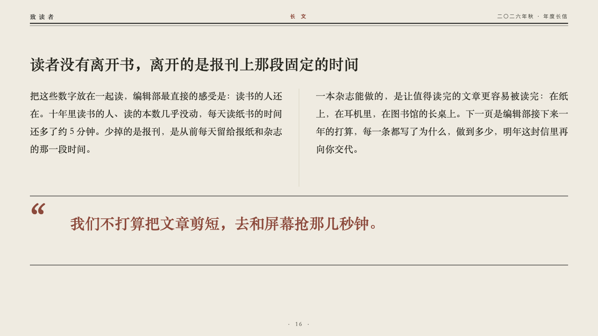
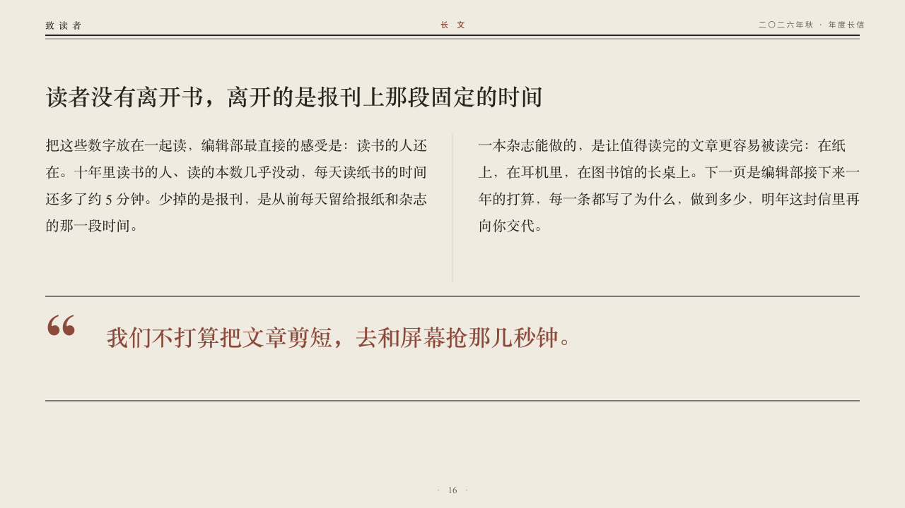

# longform

A long read in two columns under its pull quote.

Code: [`src/layouts/compositions/longform.tsx`](../../../src/layouts/compositions/longform.tsx). The header comment there is the contract. The periodical setting only.

## journal, annual letter to readers sample, 2026-10

Settled on p16. The round's decisions are in [2026-10-07-journal](../../rounds/2026-10-07-journal/README.md).

| board (p16) | engine |
| :-: | :-: |
|  |  |

**What it looks like.** The claim over the page. Under it two paragraphs side by side in the heading serif at 20/38 with a hairline between them. Under both, between two rules of the type's ink across the page, the pull quote in brick red at 32/50 with a quotation mark large in brick red at its left.

**Why.** The letter's argument in the editors' own voice, then the one sentence to keep.

**What it gave up.**

- Takes two `paragraph`s, then a `blockquote` with no attribution, in reading order.
- A paragraph past five lines of its column, marked runs in a paragraph, or a quote past two lines sends the page back.
