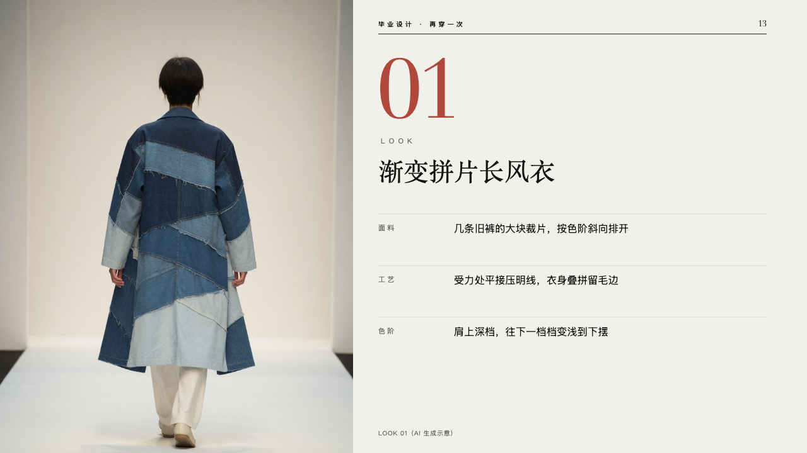
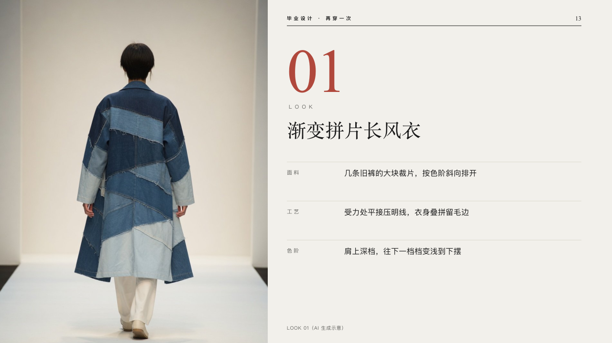

# look

One look on a page of its own.

Code: [`src/layouts/compositions/look.tsx`](../../../src/layouts/compositions/look.tsx). The header comment there is the contract. The lineup setting only.

## runway, graduation collection review sample, 2026-10

Settled on p13 (and p14 to p16). The round's decisions are in [2026-10-08-runway](../../rounds/2026-10-08-runway/README.md).

| board (p13) | engine |
| :-: | :-: |
|  |  |

**What it looks like.** The photograph runs the full height of the page from its left edge to x560. The masthead moves to the right half (`data-frame-left`, read by the motif). In that half: the look's number at 130px in the serif, the panel's title cut at its first figure (「LOOK 01」 is 「LOOK」 and 「01」), the word small and tracked 6px under it, the look's name at 40/52 in the serif (the page's claim), then its particulars, a row each under a hairline: a small grey label tracked 3px and the words beside it at 16/26. The photograph's caption small and grey at the foot. The number is crimson when the author marks it (「LOOK **01**」).

**Why.** A look is shown the way a lookbook shows it: the picture at full height, the number, the name and three particulars.

**What it gave up.**

- Takes an `image` and an `insight_panel` whose title ends in the look's number, with one to four rows and no icon or footnote, in either order. The picture's `crop` is kept.
- A name of two lines moves the particulars down a line.
- A title with no number, a name past two lines, a label wider than its column or words past two lines sends the page back.
