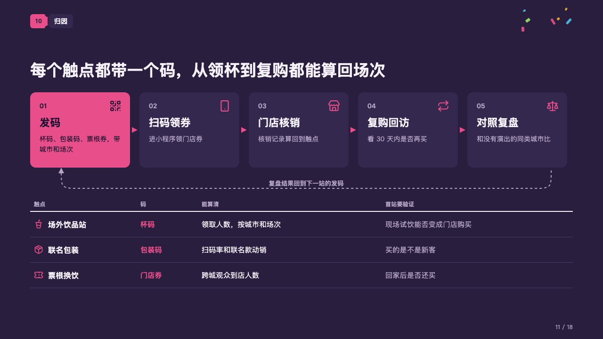
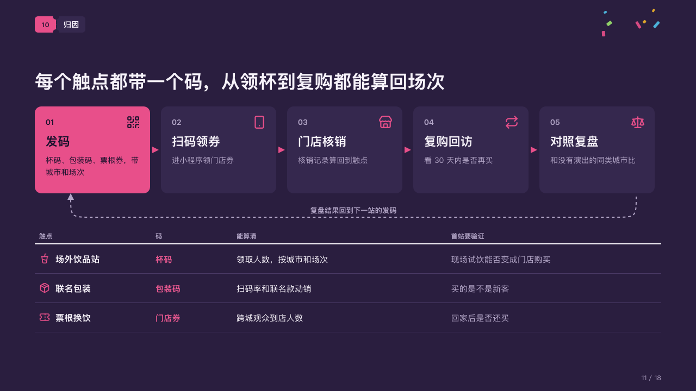

# loop

A chain of steps whose last brings its results back to the first, over the table of what each touchpoint counts.

Code: [`src/layouts/compositions/loop.tsx`](../../../src/layouts/compositions/loop.tsx). The header comment there is the contract. The marquee setting only.

## rally, summer concert season proposal sample, 2026-10

Settled on the attribution page (p11). The round's decisions are in [rounds/2026-10-06-rally](../../rounds/2026-10-06-rally/README.md).

| board (p11) | engine |
| :-: | :-: |
|  |  |

**What it looks like.** A card a step in a row, each numbered 01, 02… with its icon at the top right, its name and a line of what happens; the first, where the loop starts, a card of the magenta with the dark ink on it; small arrows of the magenta between the cards. From under the last card a dashed line runs back to under the first and points up at it, the author's line for the return on it. Under the loop an open table: headers small and grey over a 2px rule of the light, a row a touchpoint with its icon in the magenta, the first column bold, the marked column bold in the magenta, the last column grey.

**Why.** Attribution is a loop, not a funnel: what the first stop proves sets the codes for the next. The table says what each code counts and what the first stop has to show.

**What it gave up.**

- The first column and the marked one are as wide as their words and a gutter; the others share what is left.
- A `chevron_process` of three to six stages; then optionally a `callout` with no title, icon or tag, the line for the return; then a `data_table` of two to five columns with no icon, at most one marked, and two to four rows with no tag, mark or highlight.
- A stage's name past one line or its line past two, the return's line wider than the run back, or a header or cell past its column sends the page back.
