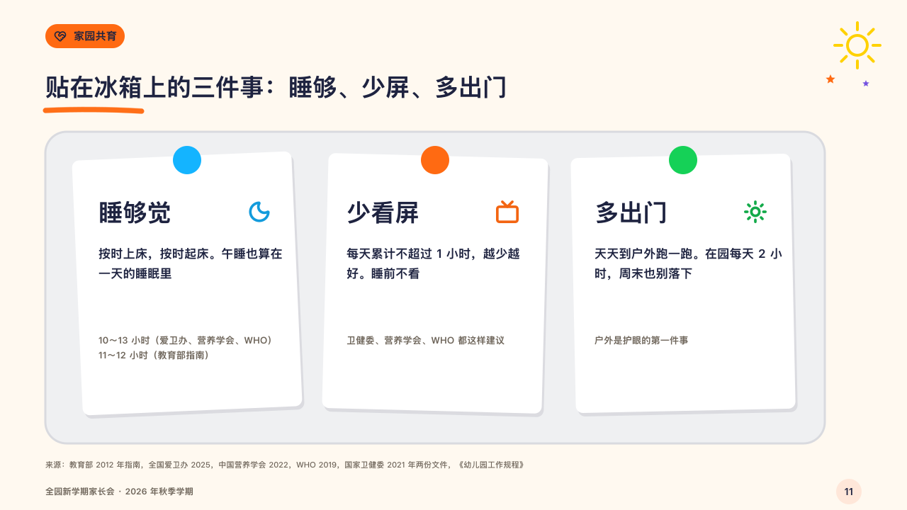

# magnets

A few things to remember at home, pinned to a fridge door.

Code: [`src/layouts/compositions/magnets.tsx`](../../../src/layouts/compositions/magnets.tsx). The header comment there is the contract. The crayonbox setting only.

## crayon, new term parents' meeting sample, 2026-10

Settled on p11. The round's decisions are in [2026-10-08-crayon](../../rounds/2026-10-08-crayon/README.md).

| board (p11) | engine |
| :-: | :-: |
|  |  |

**What it looks like.** A pale cool-grey door with a rounded edge (the ink laid thin over white), and on it a white card a thing, 310 by 360, each turned a degree or two with a solid shadow under it and a round magnet of its crayon at its top. On each card the thing's name at 34px with its symbol in its crayon at the right, what to do (17/28), and in the grey who says so (the card's `sub`, its own line breaks kept).

**Why.** Three habits a family can stick on the fridge are the page. The door is the one cool grey in the deck on purpose.

**What it gave up.**

- Takes a `numbered_cards` of two to four, every card with a symbol, a title and words.
- A marked card, or a name, words or a note past their room send the page back.
- A symbol is lifted toward the ink until it reads at 3:1 on the white card, so the sky moon is a deeper blue than the board's.
