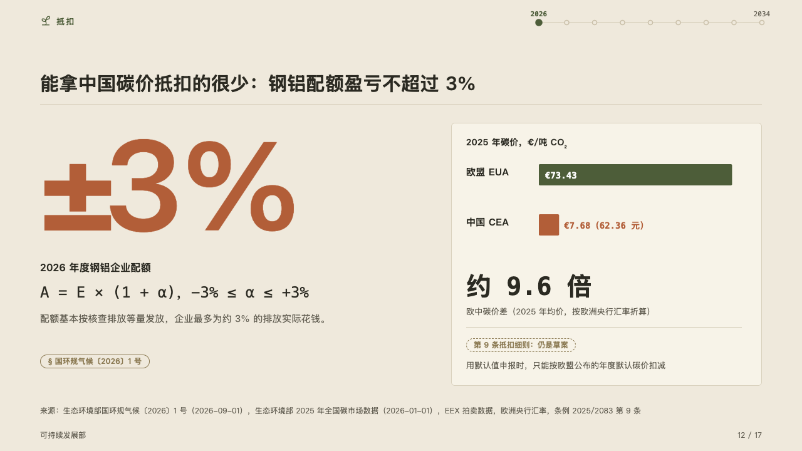
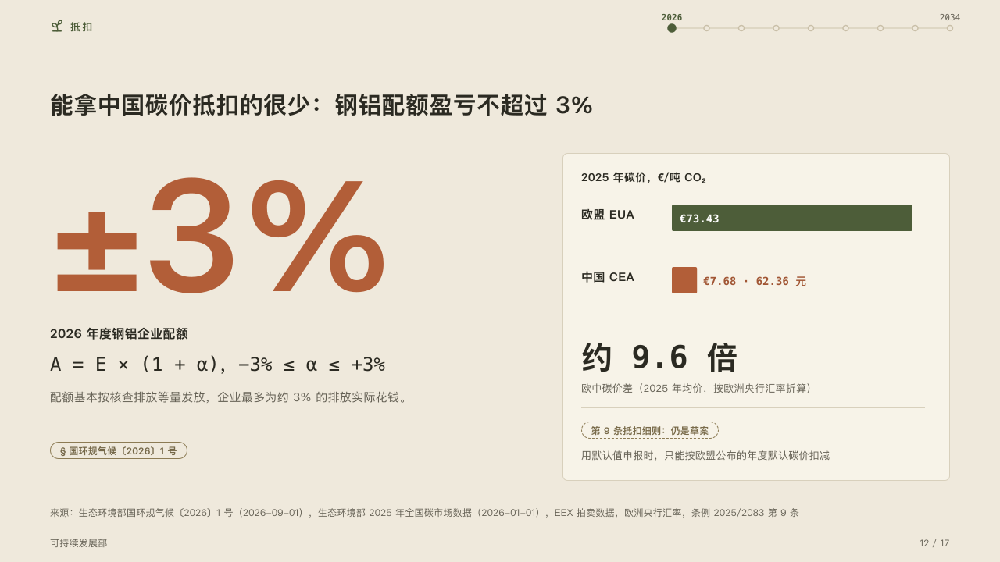

# magnitude

One figure set as large as the page allows, beside the card that puts it in proportion.

Code: [`src/layouts/compositions/magnitude.tsx`](../../../src/layouts/compositions/magnitude.tsx). The header comment there is the contract. The yearbook setting only.

## almanac, CBAM sample, 2026-10

Settled on the carbon price page (p12). The round's decisions are in [rounds/2026-10-05-almanac](../../rounds/2026-10-05-almanac/README.md).

| board (p12) | engine |
| :-: | :-: |
|  |  |

**What it looks like.** On the left the figure at 200px, bold, in the accent when the author marks it, its label bold under it, the formula it comes from in mono, its note muted and its tag, the law it rests on. On the right a card: the chart's name, a short list of bars, each its name and its value with its note, the value inside the bar in the readable ink when the bar is wide enough and after it in the bar's ink when it is not. Under the bars a second figure in mono, its label, a hairline, and its tag and note.

**Why.** 「±3%」 is the whole answer to what China's carbon price can offset, so it is the size of the page, and the price gap that explains it sits on a card beside it.

**What it gave up.**

- A `kpi_cards` of one item, a `code` of one line, a `bar` chart on its side of one series of two to four bars, none below zero, and a `kpi_cards` of one item.
- A figure wider than the left column at 200px, a formula past its line, a name or a note past its room, or anything taller than the band sends the page back.
