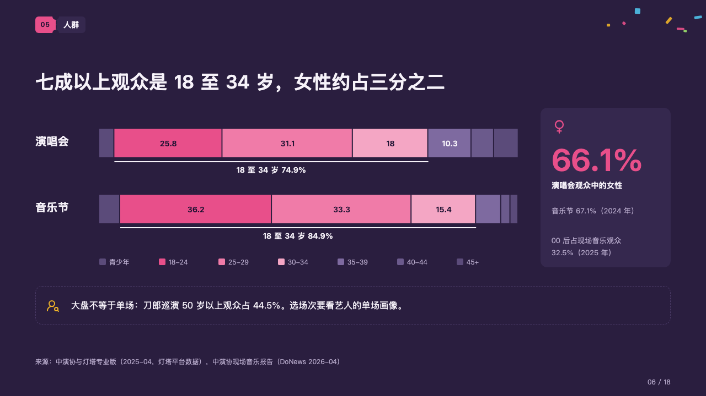
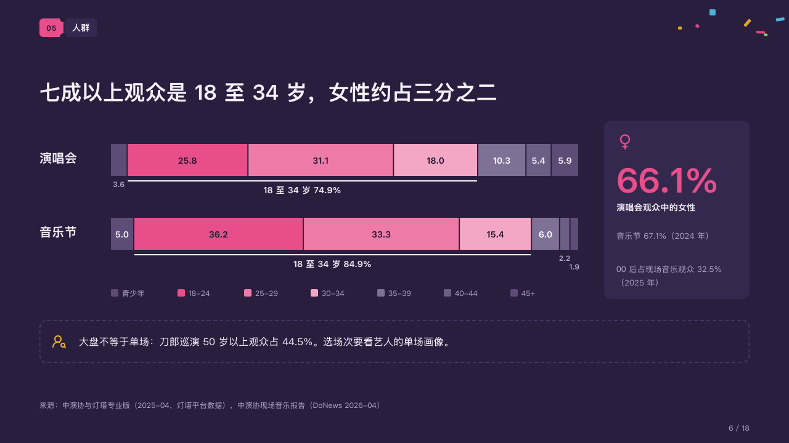

# makeup

What a crowd is made of, the run the page is about bracketed.

Code: [`src/layouts/compositions/makeup.tsx`](../../../src/layouts/compositions/makeup.tsx). The header comment there is the contract. The marquee setting only.

## rally, summer concert season proposal sample, 2026-10

Settled on the audience page (p06). The round's decisions are in [rounds/2026-10-06-rally](../../rounds/2026-10-06-rally/README.md).

| board (p06) | engine |
| :-: | :-: |
|  |  |

**What it looks like.** A bar a crowd, 52px tall, each cut into the same parts in the same order, each as long as its share. The marked run in the magenta and two lighter steps of it, the parts before it in the dim violet, those after it stepping down from a lighter violet. Under the run a white bracket with the author's line for it (`emphasis_label`, 「18 至 34 岁 74.9%」). A part's share inside it when it fits, under it in small grey type when not. A key of the parts under the bars. At the right a card: a figure in the magenta with its icon, its label and its notes. Under all of it a dashed box with a line to keep in mind and its icon in the gold.

**Why.** An age split is read as one run, not seven numbers. The bracket says which run the page is about and the card adds the second fact the claim makes.

**What it gave up.**

- Every share is drawn, inside its part or under it. The board printed only the shares of 10 and more.
- Two or three share bars (`chart`, stacked, direction horizontal), each one category naming the crowd, all with the same series in the same order, the same adjacent run marked and an `emphasis_label`; then optionally a `kpi_cards` of one item and a `callout` with no title or tag.
- A crowd's name past its column, a key past its row, a share that fits neither inside its part nor under it clear of the bracket, the bracket's line past the bar, or the card's and the box's words past their lines sends the page back.
