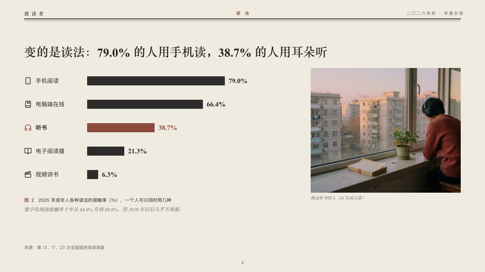

# measures

Ways of doing one thing as bars with their symbols, beside a photograph.

Code: [`src/layouts/compositions/measures.tsx`](../../../src/layouts/compositions/measures.tsx). The header comment there is the contract. The periodical setting only.

## journal, annual letter to readers sample, 2026-10

Settled on p04. The round's decisions are in [2026-10-07-journal](../../rounds/2026-10-07-journal/README.md).

| board (p04) | engine |
| :-: | :-: |
|  |  |

**What it looks like.** The claim over the page. Under it a row a way: its symbol and name at the left, its bar in the type's ink and its figure after the bar in the heading serif. The marked bar, its symbol and its figure are in brick red and its name bold. A photograph at the right with its plain caption, and under the bars the figure's number and title and the editor's comment.

**Why.** Each way of reading is known by its symbol before its name is read. The page is about listening, so that bar alone is red.

**What it gave up.**

- Takes a titled bar chart on its side of one series of two to five points at zero or above, every point with a symbol or none (`icon` on a chart point), then optionally a `callout` with words alone, then optionally an `image`.
- A tag, ranges, gaps, changes, a reference, notes or statuses leave the chart to the ordinary renderer.
- A name, figure, caption or comment past its room sends the page back.
