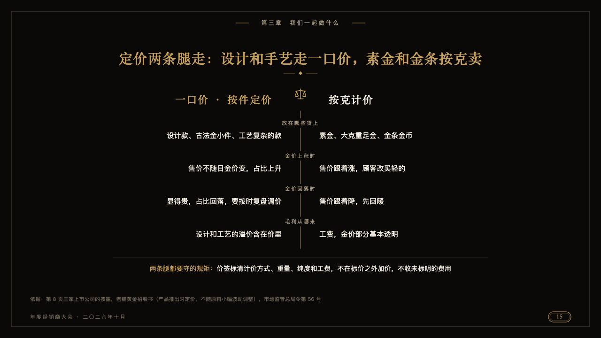
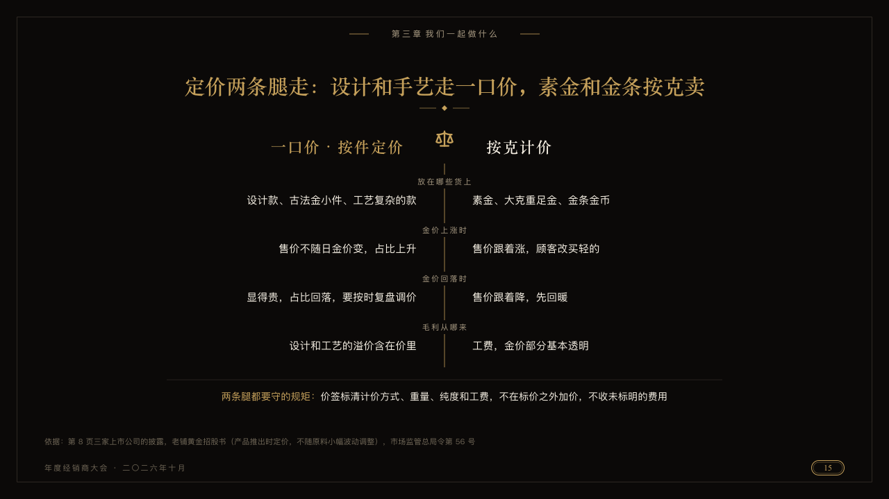

# mirror

Two ways of doing one thing set either side of a gold hairline.

Code: [`src/layouts/compositions/mirror.tsx`](../../../src/layouts/compositions/mirror.tsx). The header comment there is the contract. The invitation setting only.

## luxe, gold dealer conference sample, 2026-10

Settled on p15. The round's decisions are in [2026-10-08-luxe](../../rounds/2026-10-08-luxe/README.md).

| board (p15) | engine |
| :-: | :-: |
|  |  |

**What it looks like.** A balance at the head of a gold hairline down the middle. The first way named at the left in the gold serif against the line, the second at the right in ivory. Each row's question small and tracked on the line itself, the stock cut away behind it, the first way's answer set right against the line and the second's from it. Under a hairline the rule both ways keep, its title in gold run into its words in ivory.

**Why.** Two pricing methods are partners, not rivals. A mirror sets them as equals.

**What it gave up.**

- Takes one `comparison` of two columns and two to four rows with no icon, tag or recommendation, then optionally a `callout` with no icon or tag.
- A name, question or answer wider than its side, or a closing line past one line, sends the page back.
