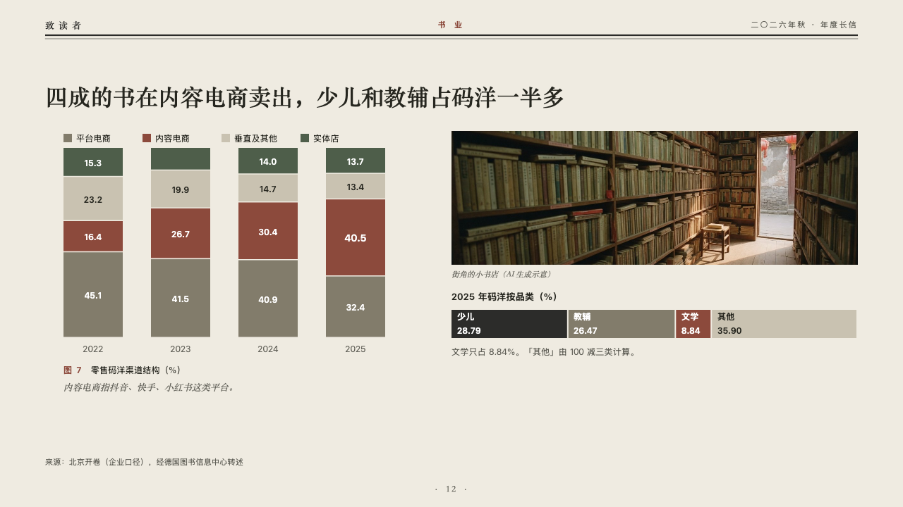
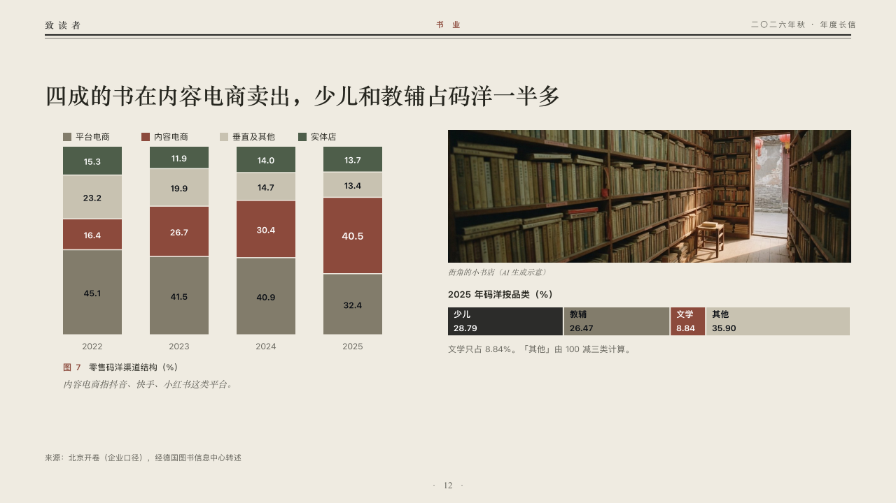

# mix

Shares by column beside a photograph and a share bar.

Code: [`src/layouts/compositions/mix.tsx`](../../../src/layouts/compositions/mix.tsx). The header comment there is the contract. The periodical setting only.

## journal, annual letter to readers sample, 2026-10

Settled on p12. The round's decisions are in [2026-10-07-journal](../../rounds/2026-10-07-journal/README.md).

| board (p12) | engine |
| :-: | :-: |
|  |  |

**What it looks like.** The claim over the page. At the left a key and a column a year cut into its shares, each share's value printed in it, the marked series in brick red and the others in the linen grey, its paler grey, the moss and the type's ink. Under the columns the figure's number and title and the editor's comment. At the right a photograph with its plain caption, the share bar's name, the share bar cut into its parts with each part's name and value printed in it, the marked part in brick red, and a note under the bar.

**Why.** Where books are sold over four years and what sold in the last: the channel the page is about is red in both.

**What it gave up.**

- Takes a titled `percent_stacked` chart of two to five series over two to five categories, optionally a `callout` with words alone, an `image`, a share bar (a `stacked` chart on its side with one category) of two to five parts, and optionally a `paragraph` (the note).
- Every share prints its value, as the author wrote it. The board left a share too short for its value blank. A share too short or a part too narrow to hold its words sends the page back.
