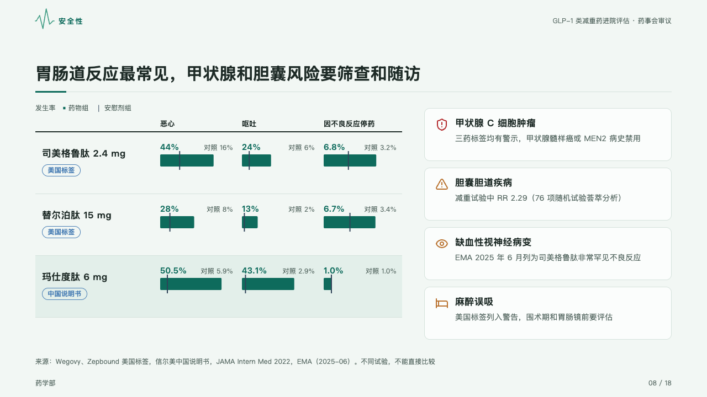
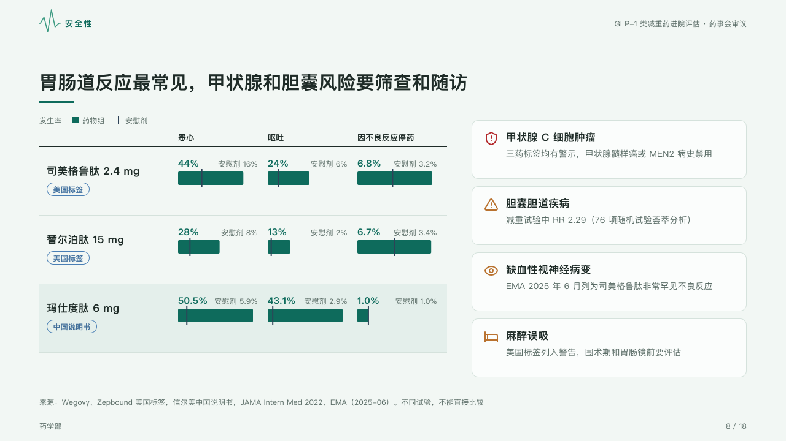

# multiples

How often each thing happens on each drug against its control, as small multiples, beside the risks to watch.

Code: [`src/layouts/compositions/multiples.tsx`](../../../src/layouts/compositions/multiples.tsx). The header comment there is the contract. The dossier setting only.

## clinic, GLP-1 formulary review sample, 2026-10

Settled on the safety page (p08). The round's decisions are in [rounds/2026-10-05-clinic](../../rounds/2026-10-05-clinic/README.md).

| board (p08) | engine |
| :-: | :-: |
|  |  |

**What it looks like.** At the left one row a drug, 112px apart, its name bold with its source capsule (the row's `tag`) under it, and one column a measure (nausea, vomiting, stopping), each cell the drug's rate as a 22px bar in the mark with its figure bold over it and its control's rate as a slate tick across the bar, named and figured small at the cell's right. Every column has its own scale. The row the page is about sits on the mark's tint. At the right the risks as cards, each its icon in its tone's ink, its title bold and a line or two under it.

**Why.** Side effects are read drug by drug against each drug's own placebo, and the serious risks are what the committee writes into the rules.

**What it gave up.**

- A `data_table` whose rows pair each drug with its control, every control row named alike, figures written as numbers with an optional unit, then optionally a `row_cards` of three to five items with icons.
- A cell that is not a figure, a control row with a tag, icon or mark, control rows named differently, or a total row sends the page back.
- The ticks stand 4px over and under their bars, where the board drew 6px, so none reaches the figure over its bar.
