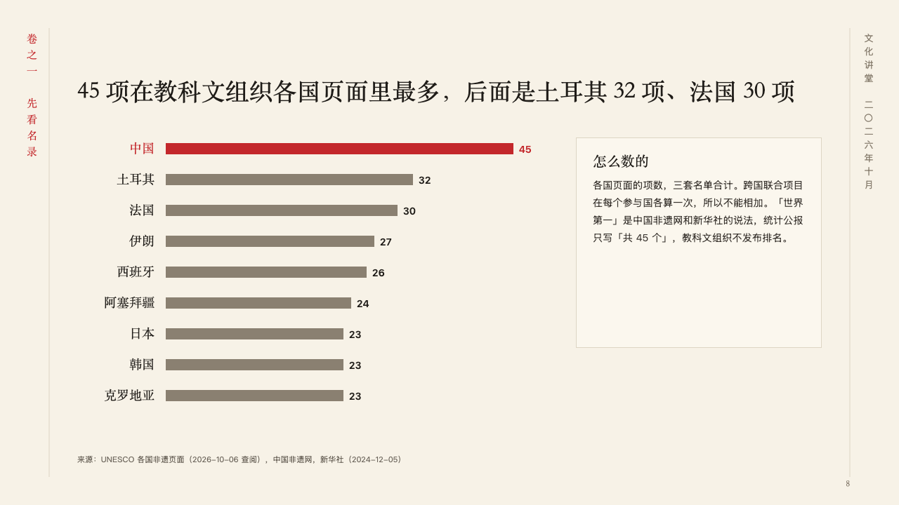
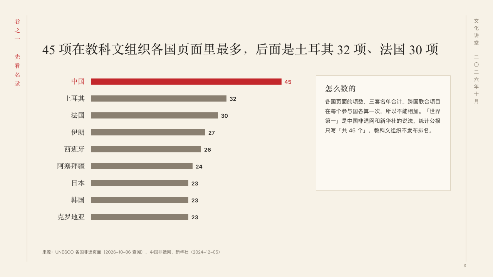

# nations

A count by country, beside how it was counted.

Code: [`src/layouts/compositions/nations.tsx`](../../../src/layouts/compositions/nations.tsx). The header comment there is the contract. The scroll setting only.

## ink, intangible heritage public lecture sample, 2026-10

Settled on p08. The round's decisions are in [2026-10-07-ink](../../rounds/2026-10-07-ink/README.md).

| board (p08) | engine |
| :-: | :-: |
|  |  |

**What it looks like.** The claim over the page. Under it a row a country, its name in the heading face set flush right, its bar in the taupe and its figure after the bar. The country the author marks (`emphasis` on its point) is in cinnabar: name, bar and figure. At the right a card a step whiter than the paper says how the counting works, its title in the heading face and its words under it.

**Why.** 「The most in the world」 is only as good as how it was counted, so the card that says how stands beside the bars, not under them.

**What it gave up.**

- Takes an untitled bar chart on its side of one series of three to ten points at zero or above, then a `callout` with a title.
- A chart with a tag, ranges, gaps, changes, bands, a reference, notes, symbols or statuses, a callout with a symbol or a tag, or a name, a figure or the card's words past their room sends the page back.
