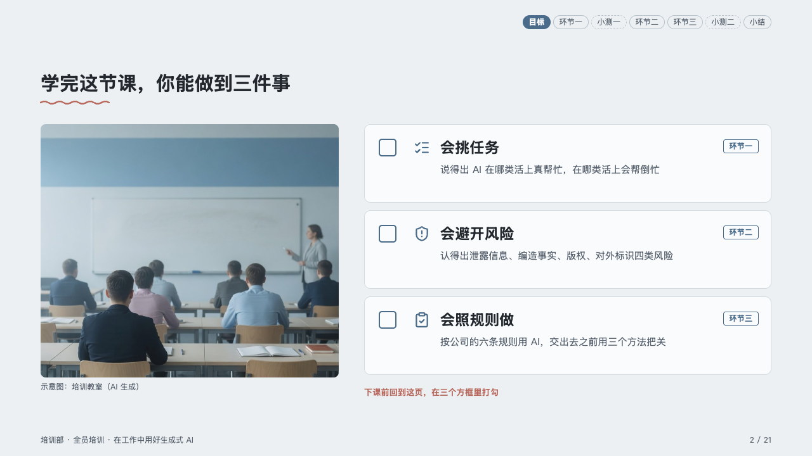
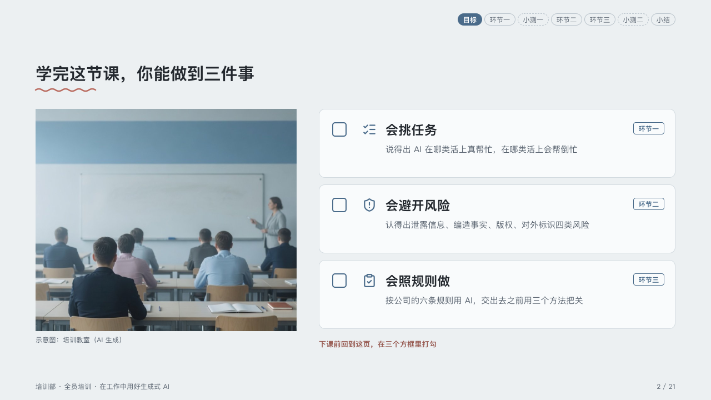

# objectives

What a class will be able to do by its end, each goal with a box to tick.

Code: [`src/layouts/compositions/objectives.tsx`](../../../src/layouts/compositions/objectives.tsx). The header comment there is the contract. The lesson setting only.

## homeroom, AI-at-work training sample, 2026-10

Settled on the goals page (p02). The round's decisions are in [rounds/2026-10-06-homeroom](../../rounds/2026-10-06-homeroom/README.md).

| board (p02) | engine |
| :-: | :-: |
|  |  |

**What it looks like.** A photograph of the room at the left, 470 by 400, its caption in 12px muted type under it. At the right a card per goal, 124px tall and 136 apart: an empty 26px box outlined in the mark, the goal's icon in the mark, its name bold at 23/34, a line or two at 15/24 in the muted ink, and the part of the lesson that teaches it as a pill at the card's top right. Under the cards, in the pen, the line that sends the room back to tick them.

**Why.** A class opens on what the room will be able to do, and closes by coming back to the same page: the boxes are left empty so the trainer can tick them in front of the room.

**What it gave up.**

- An `image`, an `icon_cards` of two to four goals each with an optional tag, then optionally a `callout` with no icon, title or tag.
- A goal's name past one line, its text past two, a pill wider than half its card or a closing line past one line sends the page back.
- The photograph is cropped square at its corners: a rounded picture needs a clip path PowerPoint's shape subset does not keep.
