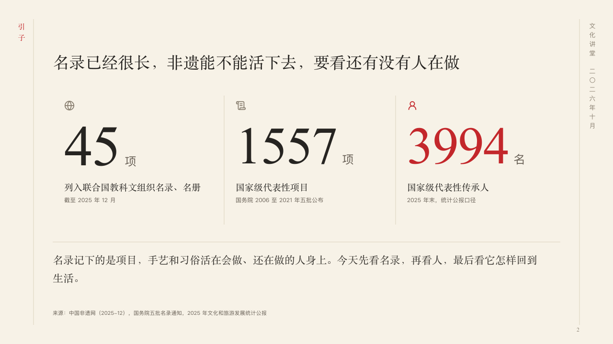

# opening

The figures a lecture opens on, over the line the speaker reads.

Code: [`src/layouts/compositions/opening.tsx`](../../../src/layouts/compositions/opening.tsx). The header comment there is the contract. The scroll setting only.

## ink, intangible heritage public lecture sample, 2026-10

Settled on p02. The round's decisions are in [2026-10-07-ink](../../rounds/2026-10-07-ink/README.md).

| board (p02) | engine |
| :-: | :-: |
|  |  |

**What it looks like.** The claim over the page. Under it two to four figures side by side, each in a column of its own past a hairline: its symbol, the figure at 110px in the heading face (120px when it is one or two characters) with its unit small after it, what it counts at 19px in the heading face and, at 12px in the grey, when and by whom. The figure the author marks (`**…**`) and its symbol are in cinnabar. Under a hairline across the page the line the speaker reads, 22/38 in the heading face.

**Why.** A lecture opens on the few figures the evening is about, then says in one line what it will do with them.

**What it gave up.**

- Takes a `kpi_cards` of two to four with labels, each with a symbol or none, then optionally a `paragraph`.
- A card with a tag, a delta, a tone or a source, more than one marked figure, or a figure, label, note or line past its room sends the page back.
