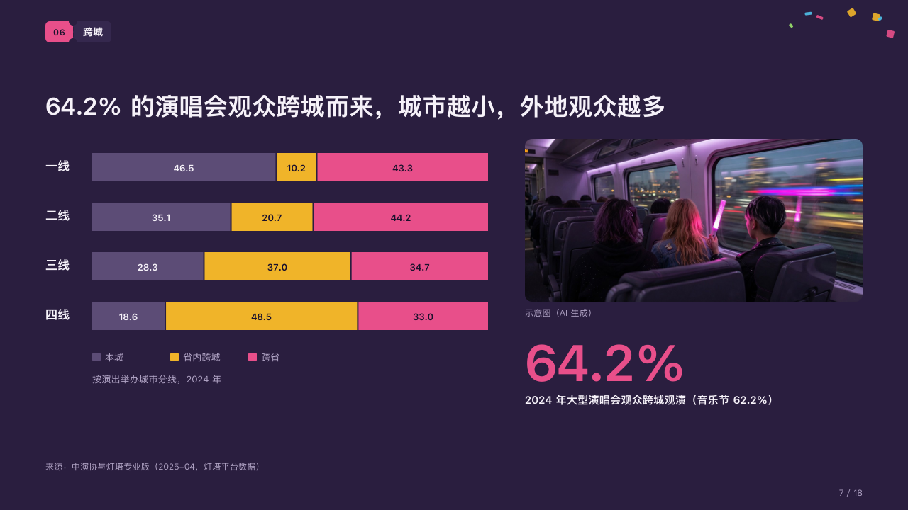

# origins

Where a crowd comes from, beside a photograph and the one figure that sums it up.

Code: [`src/layouts/compositions/origins.tsx`](../../../src/layouts/compositions/origins.tsx). The header comment there is the contract. The marquee setting only.

## rally, summer concert season proposal sample, 2026-10

Settled on the travel page (p07). The round's decisions are in [rounds/2026-10-06-rally](../../rounds/2026-10-06-rally/README.md).

| board (p07) | engine |
| :-: | :-: |
|  |  |

**What it looks like.** At the left a bar 40px tall a tier of cities, each cut into its parts with each share printed inside: the first part, the one the others are read against, in the dim violet; the last, the one the page is about, in the magenta; those between in the confetti colours. A key under the bars and the chart's caption under the key. At the right a photograph 476 by 230 with its caption, and under it one figure at 72px in the magenta with its line.

**Why.** Smaller cities draw more travellers. The bars show the shift tier by tier, the photograph says what travelling to a show looks like, and the figure is the number the claim quotes.

**What it gave up.**

- A `percent_stacked` chart of two to five categories and two to four series with nothing marked and no tag; then an `image` with an asset; then a `kpi_cards` of one item with no delta, tag, icon or source.
- A share wider than its part, a tier's name past its column, a key past the bars' width, a caption past one line or the figure's line past two lines sends the page back.
