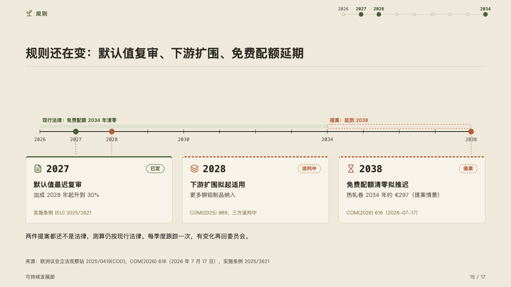
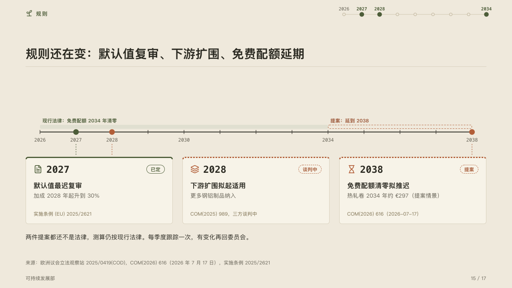

# outlook

The rules ahead on a run of years, which are law and which are only proposed.

Code: [`src/layouts/compositions/outlook.tsx`](../../../src/layouts/compositions/outlook.tsx). The header comment there is the contract. The yearbook setting only.

## almanac, CBAM sample, 2026-10

Settled on the rules page (p15). The round's decisions are in [rounds/2026-10-05-almanac](../../rounds/2026-10-05-almanac/README.md).

| board (p15) | engine |
| :-: | :-: |
|  |  |

**What it looks like.** One axis of years across the band, a tick for each year, its first year, the rules' years, the spans' edges and the decades named in mono under it. Over the axis the timeline's spans (`periods`): a span the law sets on the mark's tint, a span that rests on a proposal as a dashed outline in the accent, each named over its start in its own ink. Each rule is a node on its year and a dashed stem down to its card, the stem starting under the year's name so no line runs through it. On the card the year in mono beside its icon, its tag at the top right, its title bold, its description muted and its source in the quiet ink. A rule whose tag says it is not settled takes the accent for its node, stem and icon and a dashed top edge, the others take the mark. Under the cards a closing line.

**Why.** Whether a figure can go into a budget depends on whether the rule behind it is law, so a proposal's span, node and card are dashed in the accent and the law's are solid.

**What it gave up.**

- A `timeline` of two to four milestones dated by a year, with up to three periods dated by a year, across at most twenty years, no lane, tone or highlight. Then optionally one `callout` with no icon, title or tag.
- A date written otherwise, a title or a source past one line of its card, a description past two, or anything taller than the band sends the page back.
