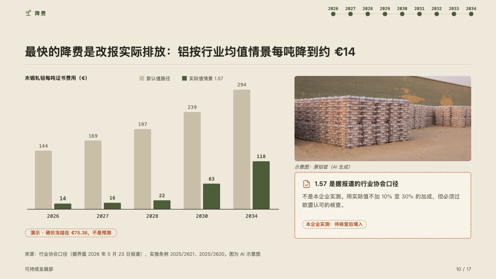
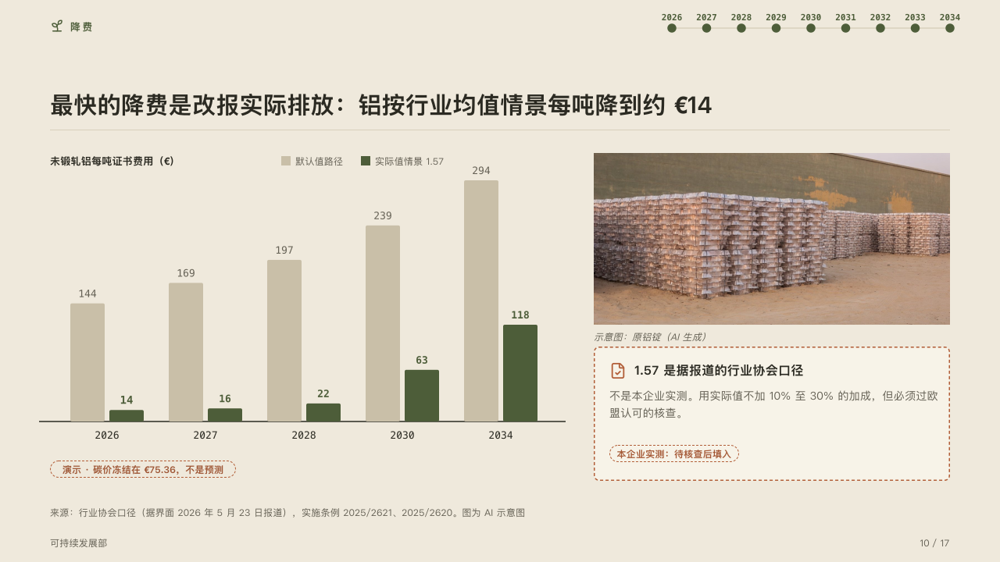

# paired

Two ways of counting the same cost, side by side year by year.

Code: [`src/layouts/compositions/paired.tsx`](../../../src/layouts/compositions/paired.tsx). The header comment there is the contract. The yearbook setting only.

## almanac, CBAM sample, 2026-10

Settled on the actual-values page (p10). The round's decisions are in [rounds/2026-10-05-almanac](../../rounds/2026-10-05-almanac/README.md).

| board (p10) | engine |
| :-: | :-: |
|  |  |

**What it looks like.** Upright bars in pairs and no value axis: the way the page argues for (`emphasis` on its series) in the mark, the other in the ghost, each bar's value in mono over it, the marked one bold in the mark. The years in mono under a baseline, the chart's name and unit over the plot with a small legend beside it, and under the plot the chart's `tag`, the pill that says the amounts are a demonstration. On the right a photograph with its caption, and under it the note that says what the figures rest on: a card edged in the accent and dashed when its tag says a figure is still pending, its icon and title over its text and the tag at its foot.

**Why.** The saving is the gap between two bars in each year, so the bars stand in pairs and the gap is read directly. The figure that makes the saving (1.57) is an industry association's, so the note beside it says so before anyone quotes it.

**What it gave up.**

- An upright `bar` chart of two series, one of them marked, over two to seven categories, none below zero. An `image`. A `callout`.
- A value wider than its bar's pair, a title or text past its lines, or anything taller than the band sends the page back.
