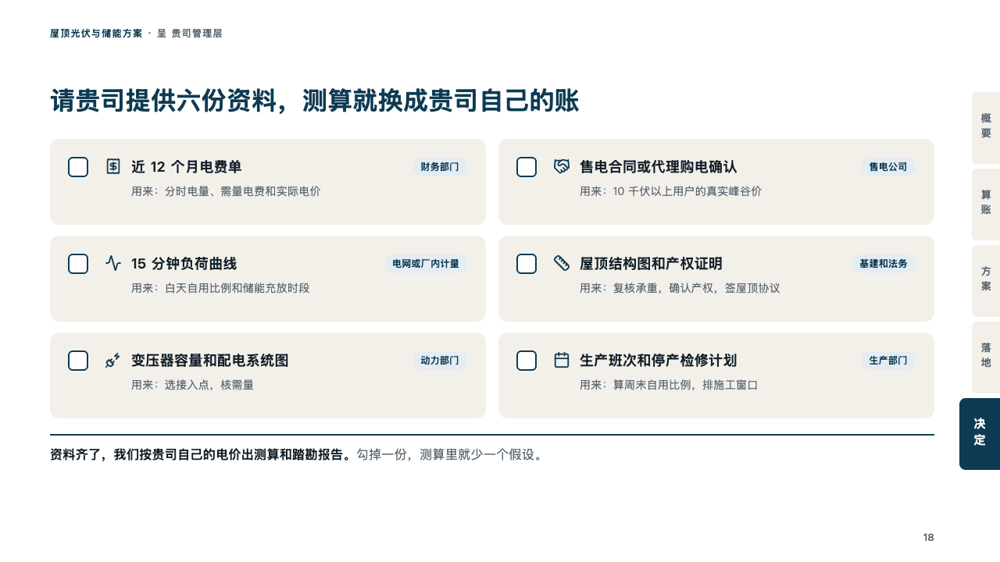
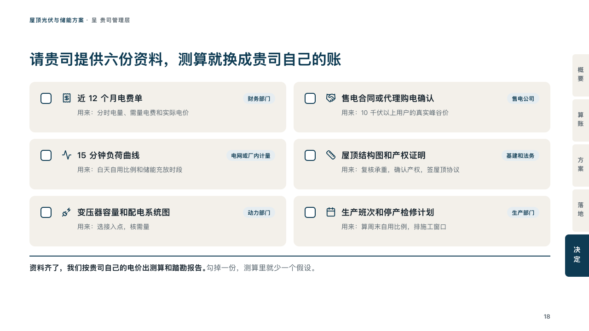

# papers

What a client is asked to hand over, as a checklist.

Code: [`src/layouts/compositions/papers.tsx`](../../../src/layouts/compositions/papers.tsx). The header comment there is the contract. The binder setting only.

## proposal, rooftop solar and storage proposal sample, 2026-10

Settled on the documents page (p18). The round's decisions are in [rounds/2026-10-06-proposal](../../rounds/2026-10-06-proposal/README.md).

| board (p18) | engine |
| :-: | :-: |
|  |  |

**What it looks like.** Two columns of cards of sand, each a paper: an empty box to tick, its icon in petrol, its name bold, what it is used for in grey, and who holds it as a pale petrol chip at the card's top right. Under the cards, the closing line under a 2px rule of petrol, its first sentence bold and the rest grey.

**Why.** The proposal's figures become the client's own once the client's papers arrive. A box per paper and the department that holds it make the request easy to hand on.

**What it gave up.**

- Takes an `icon_cards` of two to six with no title or tone, each with a tag, then optionally a `callout` with no title, icon or tag.
- A name past one line, a text past one line beside its chip, or a closing line past one line sends the page back.
