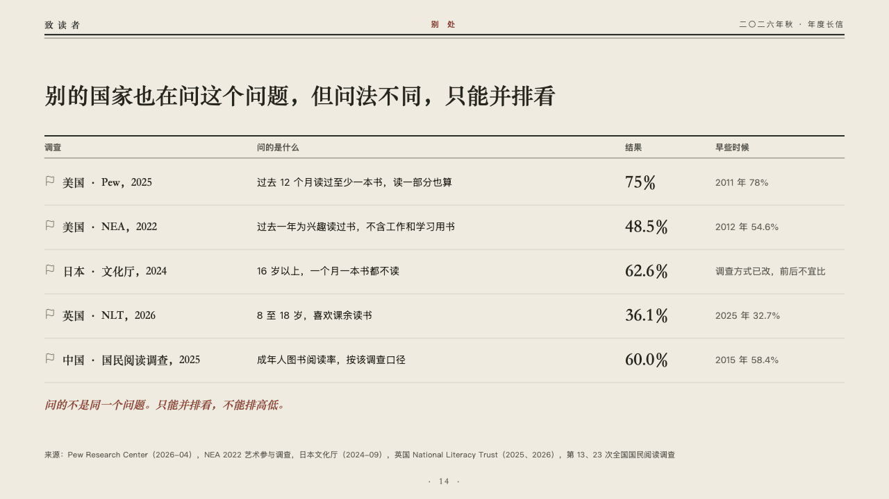
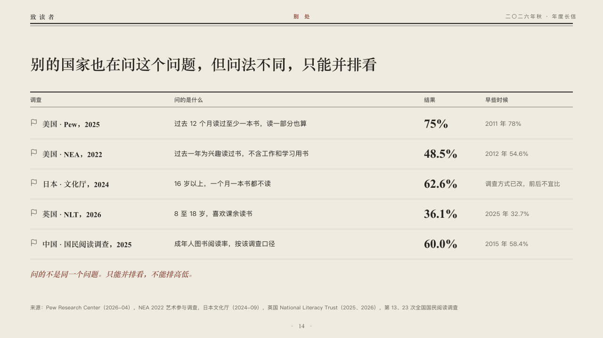

# parallel

Findings that answer different questions, set side by side and never ranked.

Code: [`src/layouts/compositions/parallel.tsx`](../../../src/layouts/compositions/parallel.tsx). The header comment there is the contract. The periodical setting only.

## journal, annual letter to readers sample, 2026-10

Settled on p14. The round's decisions are in [2026-10-07-journal](../../rounds/2026-10-07-journal/README.md).

| board (p14) | engine |
| :-: | :-: |
|  |  |

**What it looks like.** The claim over the page. Under it an open table between a heavy rule and a hairline: a row a source, its symbol in the linen grey, its name in the heading serif, what it asks, its figure large in the heading serif and where it stood earlier in the grey. One italic line in brick red under the table says why the rows are not to be read against each other.

**Why.** Pew, the NEA, Japan's agency, the National Literacy Trust and China's survey each ask a different question. The table keeps the order the author wrote and the line under it forbids a ranking.

**What it gave up.**

- Takes an untitled `data_table` of four columns (who asked, what they asked, the figure, the earlier reading) and two to five rows, every row with a symbol or none, then a `callout` with words alone.
- A source, a marked column or row, a total row, tags, a cell past its column or a closing line past one line sends the page back.
