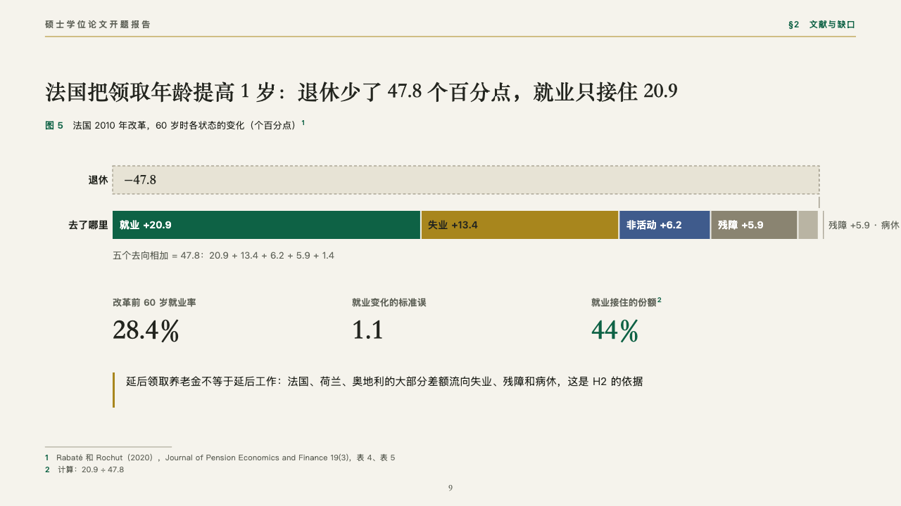
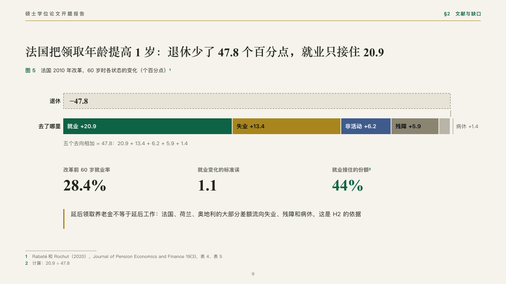

# partition

A whole and where it went, as parts laid end to end.

Code: [`src/layouts/compositions/partition.tsx`](../../../src/layouts/compositions/partition.tsx). The header comment there is the contract. The manuscript setting only.

## thesis, retirement age thesis proposal sample, 2026-10

Settled on France's decomposition (p09). The round's decisions are in [rounds/2026-10-06-thesis](../../rounds/2026-10-06-thesis/README.md).

| board (p09) | engine |
| :-: | :-: |
|  |  |

**What it looks like.** The figure's number and title, then two bars on one scale: the whole that fell away (the chart's one negative bar) as a dashed grey box with its figure inside, and under it the parts it went to, end to end in emerald, gold, indigo and two pebbles, each named inside its part when the part is wide enough and the narrow ones named after the bar. A sum line the author writes, then up to four figures in the heading serif, the marked one in emerald, and a closing line with a gold bar.

**Why.** France's reform cut retirement by 47.8 points and only 20.9 went to work. The two bars on one scale show the rest went to unemployment, inactivity, disability and sick leave.

**What it gave up.**

- Takes a titled horizontal `bar` chart of one series, one negative bar and two to six positive bars that add up to its size, then optionally a `kpi_cards` of one to four and a `callout`.
- Parts that do not add up, a name or a figure past its line, or a closing line past two lines sends the page back.
- Only the parts too narrow to be named inside are named after the bar, and the pebble parts carry their names in the ink.
