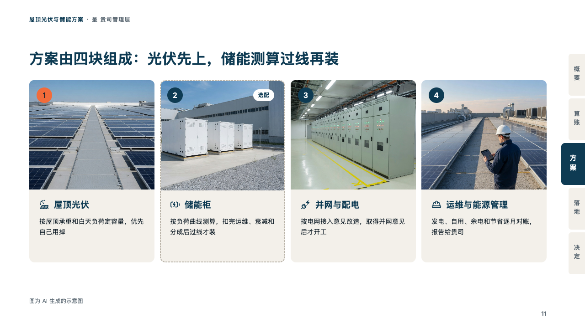
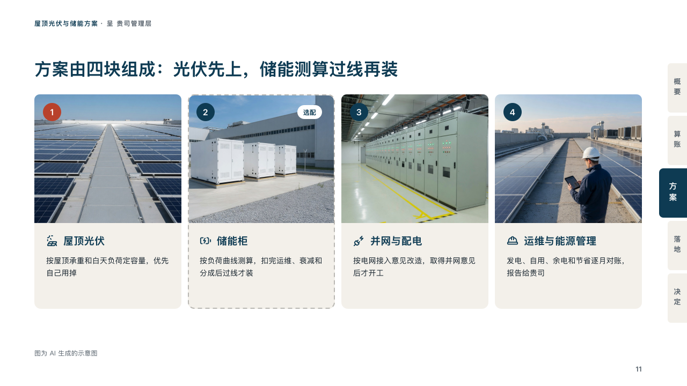

# parts

What a solution is made of, a photograph and a card a part.

Code: [`src/layouts/compositions/parts.tsx`](../../../src/layouts/compositions/parts.tsx). The header comment there is the contract. The binder setting only.

## proposal, rooftop solar and storage proposal sample, 2026-10

Settled on the solution page (p11). The round's decisions are in [rounds/2026-10-06-proposal](../../rounds/2026-10-06-proposal/README.md).

| board (p11) | engine |
| :-: | :-: |
|  |  |

**What it looks like.** A card a part, side by side: its photograph across the card's top, its number in a petrol disc on the photograph (the first in the brick red when the grid leads with it), its tag as a white chip at the photograph's right, and under the photograph its icon and name in petrol and a few lines on it. A part whose tag is not settled yet (a `basis` of estimate, pending or proposal, 「选配」) is a card outlined dashed.

**Why.** A client buys parts they can picture. A photograph each, and the optional part marked by its outline, says what is in the offer and what is not yet.

**What it gave up.**

- Takes an `image_grid` of two to four pictures, each with an icon and a caption written "name：what", tags allowed. The colon is declared, not printed.
- A name past one line, a text past three lines or a tag wider than its photograph sends the page back.
