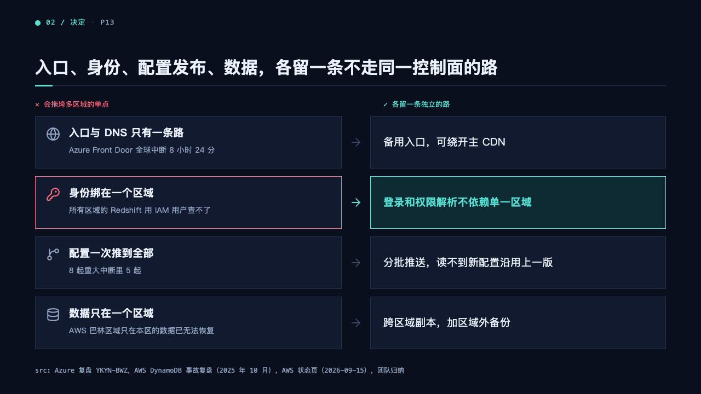
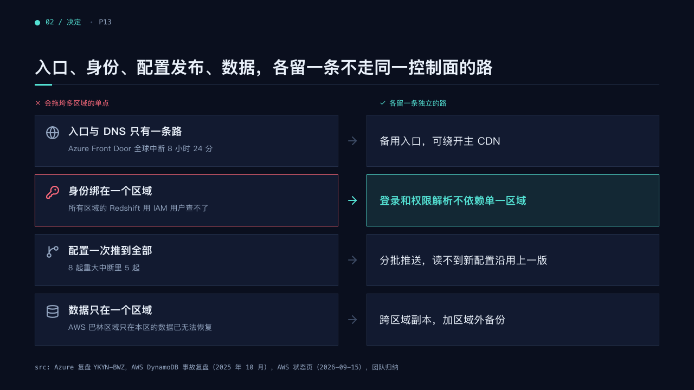

# paths

An issue tree read as failure points and the independent path each one needs.

Code: [`src/layouts/compositions/paths.tsx`](../../../src/layouts/compositions/paths.tsx). The console setting only.

## terminal, cloud outage review sample, 2026-10

| board (p13) | engine |
| :-: | :-: |
|  |  |

The round's decisions are in [rounds/2026-10-05-terminal](../../rounds/2026-10-05-terminal/README.md).

**What it looks like.** Two columns under two mono headers: the tree's `question` after a ✕ in the danger ink, its `children_column` after a ✓ in the mark. Each branch is a row: a card with the branch's `icon`, its label bold at 19px and its note at 14px, then an arrow, then a card with its sub-points at 19px. The marked branch has its card edged and its icon in the danger ink, the arrow in the mark, and its fix on the mark's tint, bold in the mark.

**Why.** Every single point that drags down all regions should sit beside what removes it.

**What it gave up.**

- Only trees with a `children_column`, two to five branches and one or two sub-points each.
