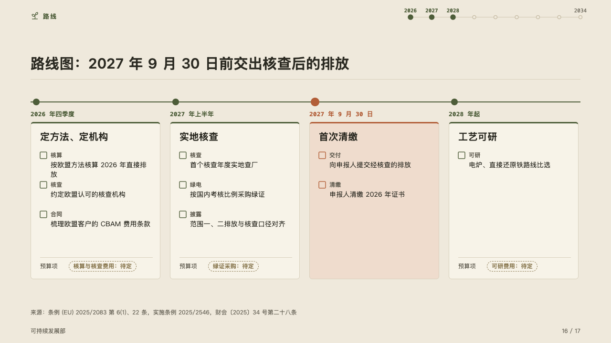
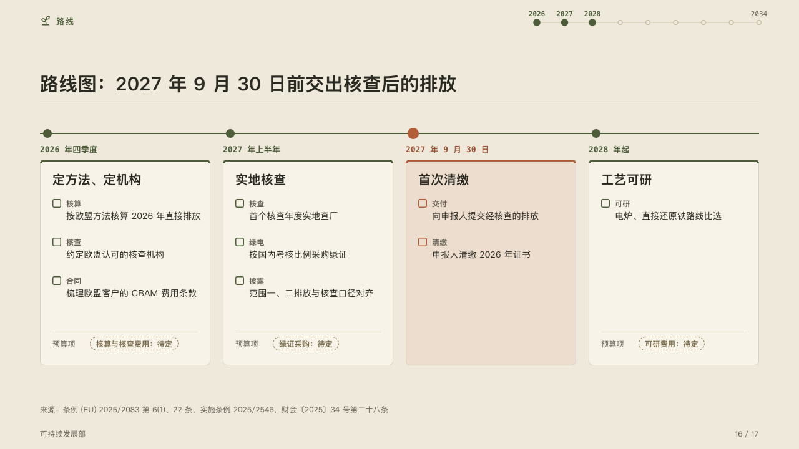

# phases

The work in phases on one line, each with its open items and the budget line it still needs.

Code: [`src/layouts/compositions/phases.tsx`](../../../src/layouts/compositions/phases.tsx). The header comment there is the contract. The yearbook setting only.

## almanac, CBAM sample, 2026-10

Settled on the roadmap page (p16). The round's decisions are in [rounds/2026-10-05-almanac](../../rounds/2026-10-05-almanac/README.md).

| board (p16) | engine |
| :-: | :-: |
|  |  |

**What it looks like.** A rule in the mark across the band with a dot for each phase, its period in mono under the dot, and under it a card: a 3px top edge, the phase's title bold, then each row as an empty box to tick, the row's label small and muted over its value. A row whose value is not settled (`basis` on the row, a budget line still to be set) stands at the card's foot under a hairline: its label, and its value in a dashed pill. The phase the page is about (`emphasis`) takes the accent for its dot, period, edge and boxes, and its card the accent's tint.

**Why.** A roadmap that asks for money shows which lines are not priced yet, at the foot of the phase that needs them, in the pill that says so.

**What it gave up.**

- A `roadmap` of two to four phases, each with a period, at most one row in each not settled, alone on the page.
- An icon on a phase, a title past one line, a value past two lines of its card, a pill past its card, or rows taller than the card sends the page back. A roadmap with phase icons is drawn by the ordinary component in the same band.
