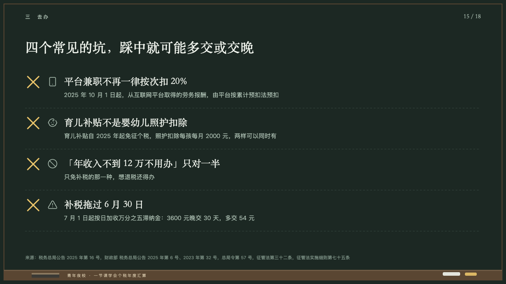
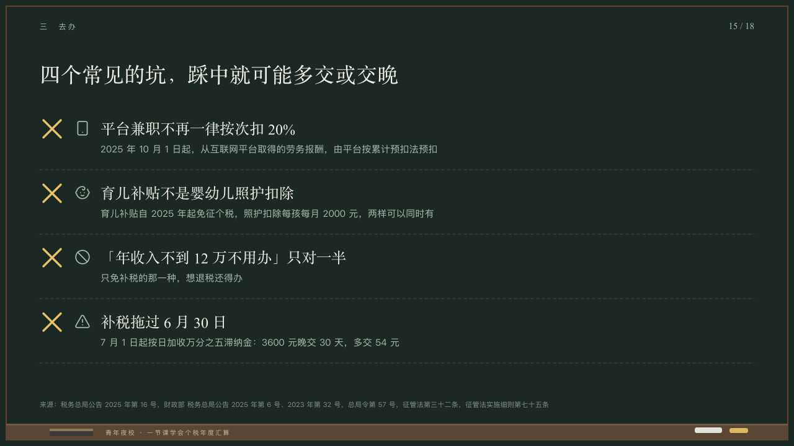

# pitfalls

Mistakes struck with a cross of yellow chalk.

Code: [`src/layouts/compositions/pitfalls.tsx`](../../../src/layouts/compositions/pitfalls.tsx). The header comment there is the contract. The chalkboard setting only.

## lecture, annual tax reconciliation evening class sample, 2026-10

Settled on p15. The round's decisions are in [2026-10-08-lecture](../../rounds/2026-10-08-lecture/README.md).

| board (p15) | engine |
| :-: | :-: |
|  |  |

**What it looks like.** Three to five rows from y186 every 104px under dashed lines: a cross of yellow chalk 28px square, the symbol at 26px in the grey, the mistake at 24/36 in the serif and what is true instead at 15/26 in the grey under it.

**Why.** The traps people fall into, crossed out so nobody copies them down as rules.

**What it gave up.**

- Takes a `row_cards` of three to five items, every one an icon, a title and a text marked as something that goes wrong (`tone: "danger"`). The cross is the board's yellow chalk, not the theme's danger ink.
