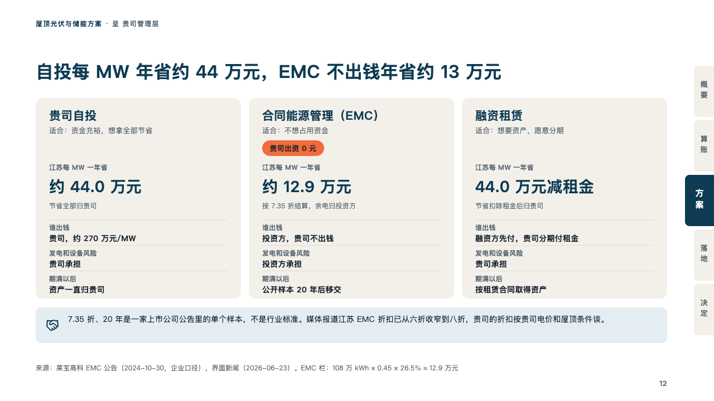
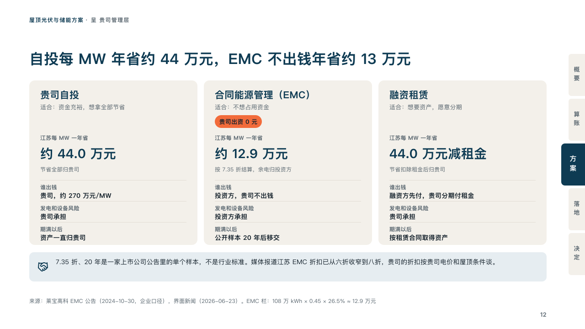

# plans

The ways a client can pay, as cards with what each saves.

Code: [`src/layouts/compositions/plans.tsx`](../../../src/layouts/compositions/plans.tsx). The header comment there is the contract. The binder setting only.

## proposal, rooftop solar and storage proposal sample, 2026-10

Settled on the funding models page (p12). The round's decisions are in [rounds/2026-10-06-proposal](../../rounds/2026-10-06-proposal/README.md).

| board (p12) | engine |
| :-: | :-: |
|  |  |

**What it looks like.** A card of sand a way to pay: its name at 21px in petrol, who it suits in small grey and, after a " · ", a part marked whole as a chip of the brick red under it (「贵司出资 0 元」). Then the marked row's label in small grey over its figure at 34px in petrol (28px for a figure of nine characters or more), with the part after a " · " as a line under it. Then each labelled row under a hairline as its label in small grey over its value at 14px bold. Under the cards, a bar of the pale petrol with the note's icon and two lines.

**Why.** Who pays decides who owns the equipment and who keeps the savings. Setting each way on its own card, with the same rows in the same places, lets the finance lead pick by reading across.

**What it gave up.**

- Takes a `comparison` of two to four columns with no title, label column, tags, icons or recommendation, its rows in this order: optionally a row with no label (who each suits), the marked row (the figures), then one to three labelled rows, then optionally a `callout` with no title or tag.
- The " · " is declared, not printed.
- A name past one line, any line past its card, a figure wider than its card or a note past two lines sends the page back.
