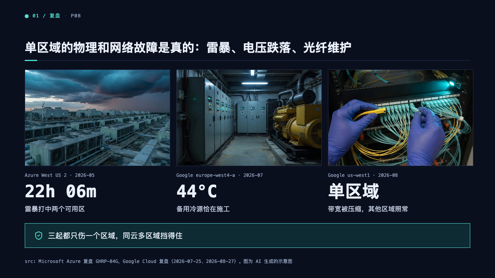
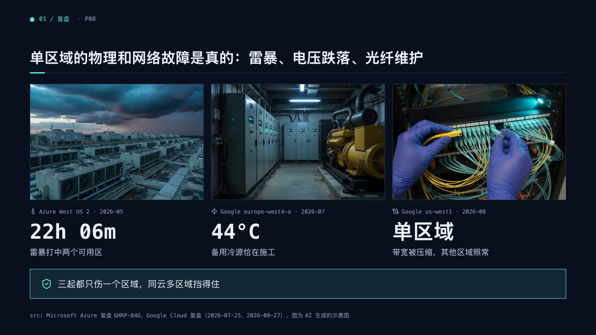

# plates

Photographs in a row, each over its figure, and a banner under them.

Code: [`src/layouts/compositions/plates.tsx`](../../../src/layouts/compositions/plates.tsx). The console setting only.

## terminal, cloud outage review sample, 2026-10

| board (p08) | engine |
| :-: | :-: |
|  |  |

The round's decisions are in [rounds/2026-10-05-terminal](../../rounds/2026-10-05-terminal/README.md).

**What it looks like.** An `image_grid` of two to four photographs cropped to fill their frames inside a 1px edge, each with its caption in 12px mono (an `icon` before it when the caption has one), then the matching `kpi_cards` figure in bold mono at 44px and its label at 17px. The marked figure takes the mark, a figure with a tone its ink. A closing callout is a banner across the foot.

**Why.** Single-region failures are physical: a photograph makes "a storm, a voltage dip, a fibre cut" real, and the figure under each says how bad it was.

**What it gave up.**

- The pictures and the figures must be as many. Photographs shorter than 160px send the page back.
