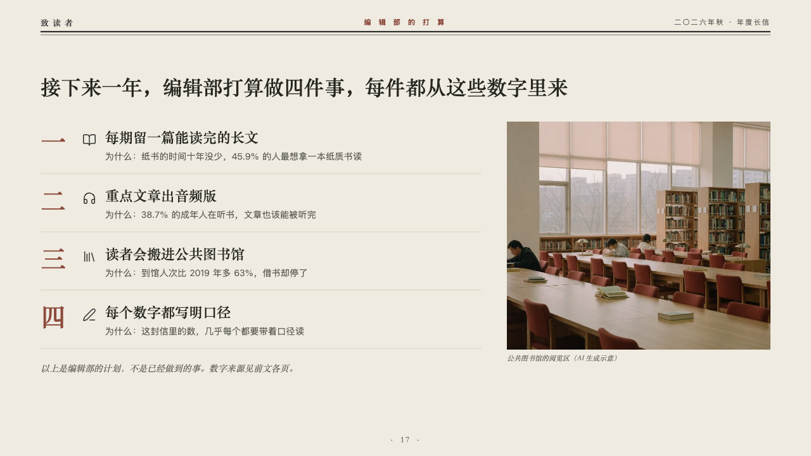

# pledges

What the editors plan to do, each with why, beside a photograph.

Code: [`src/layouts/compositions/pledges.tsx`](../../../src/layouts/compositions/pledges.tsx). The header comment there is the contract. The periodical setting only.

## journal, annual letter to readers sample, 2026-10

Settled on p17. The round's decisions are in [2026-10-07-journal](../../rounds/2026-10-07-journal/README.md).

| board (p17) | engine |
| :-: | :-: |
|  |  |

**What it looks like.** The claim over the page. Under it a ruled row a plan: its number large in brick red in the heading serif (「一」 to 「四」 in a Chinese deck, 「1」 to 「4」 in any other), its symbol in the type's ink, what will be done in the heading serif and under it in the grey the line that says why. A photograph at the right with its plain caption, and a closing line in the italic serif under the rows.

**Why.** Each plan carries the number it comes from, and the closing line says these are plans, not results.

**What it gave up.**

- Takes an untitled `icon_cards` of two to four with no tags or tones, an `image`, then optionally a `callout` with words alone.
- A plan or a reason past one line, or a caption or closing line past its room, sends the page back.
