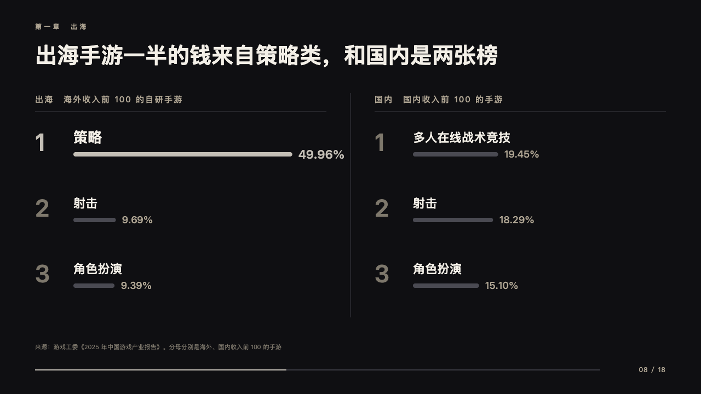
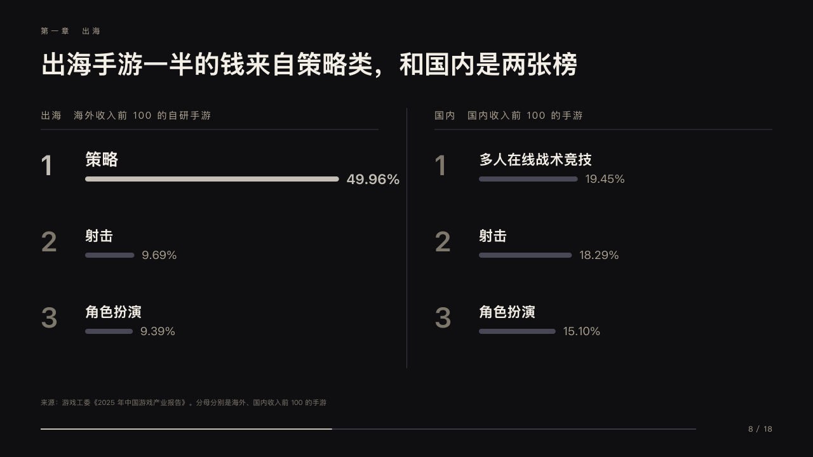

# podiums

Two leaderboards side by side.

Code: [`src/layouts/compositions/podiums.tsx`](../../../src/layouts/compositions/podiums.tsx). The header comment there is the contract. The keynote setting only.

## stage, game developers keynote sample, 2026-10

Settled on p08. The round's decisions are in [2026-10-08-stage](../../rounds/2026-10-08-stage/README.md).

| board (p08) | engine |
| :-: | :-: |
|  |  |

**What it looks like.** Two columns at x64 and x684, each 532px, each named over a hairline on y204 by the chart's title and its series at 15px tracked 2px (「出海　海外收入前 100 的自研手游」), a hairline between them. In each the places from y230 every 120px: a rank at 44px, the name at 22px bold, a thin bar to one scale for both boards (400px at a round ceiling over the largest value) and the value after it. The marked place has its rank, bar and value in silver and its name at 26px.

**Why.** What sells abroad and at home are two different lists, and the room should see that before it reads a number.

**What it gave up.**

- Takes two bar charts on their side of two to four places each, largest first. The values share each column's decimals (「15.10%」 beside 「49.96%」).
- The header carries the chart's series as well as its title, since every word an author writes is drawn.
