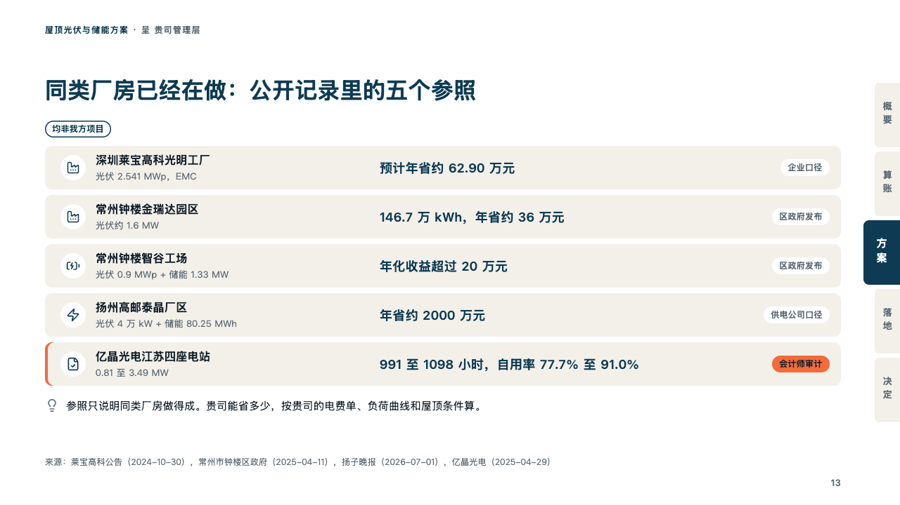
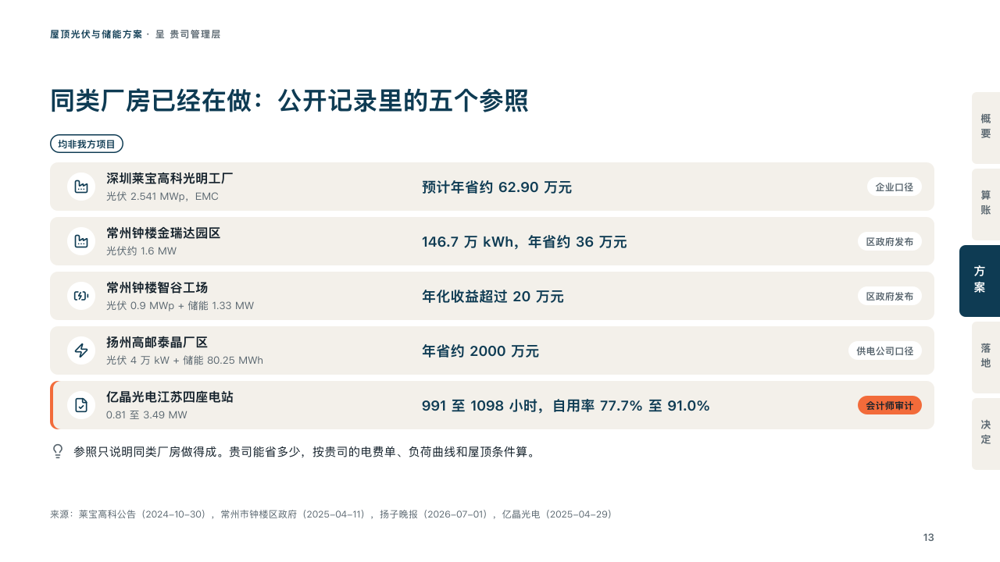

# precedents

Public records a client can check, a bar a record with the kind of source behind its figure.

Code: [`src/layouts/compositions/precedents.tsx`](../../../src/layouts/compositions/precedents.tsx). The header comment there is the contract. The binder setting only.

## proposal, rooftop solar and storage proposal sample, 2026-10

Settled on the public references page (p13). The round's decisions are in [rounds/2026-10-06-proposal](../../rounds/2026-10-06-proposal/README.md).

| board (p13) | engine |
| :-: | :-: |
|  |  |

**What it looks like.** Over the rows the table's title as a chip outlined in petrol (「均非我方项目」, whose they are not). A row a record on a bar of sand: its icon in a white disc, its name bold over its scale in grey, its figure at 18px in petrol and the kind of source the figure is as a white chip at the right. The record the page leans on (a row marked `highlight`) has a brick-red edge at its left and its chip in the brick red. Under the rows, a line with a grey icon on what the records do not show.

**Why.** A supplier's own references are what a client trusts least. Public records, each tagged with who reported the figure and said plainly not to be the supplier's own, are ones the client can look up.

**What it gave up.**

- Takes a `data_table` with a title, three columns with no headers (the name, the scale, the figure), two to six rows each with an icon and a tag, at most one marked `highlight`, no total, then optionally a `callout` with no title or tag.
- A name, scale or figure past its column, a chip past the row's end or a line past one line sends the page back.
