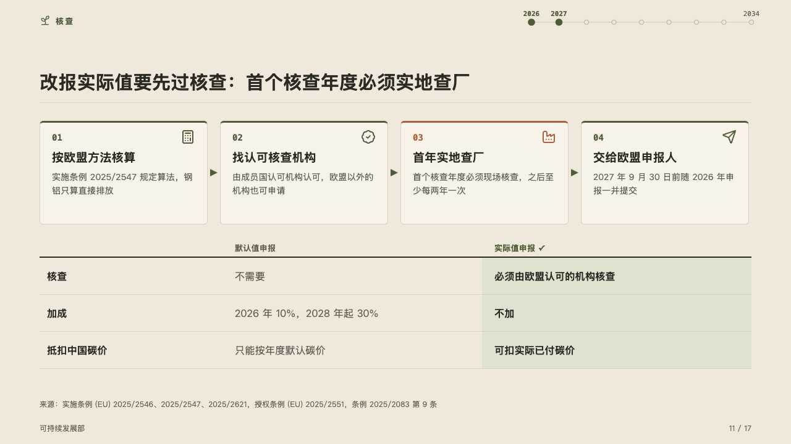
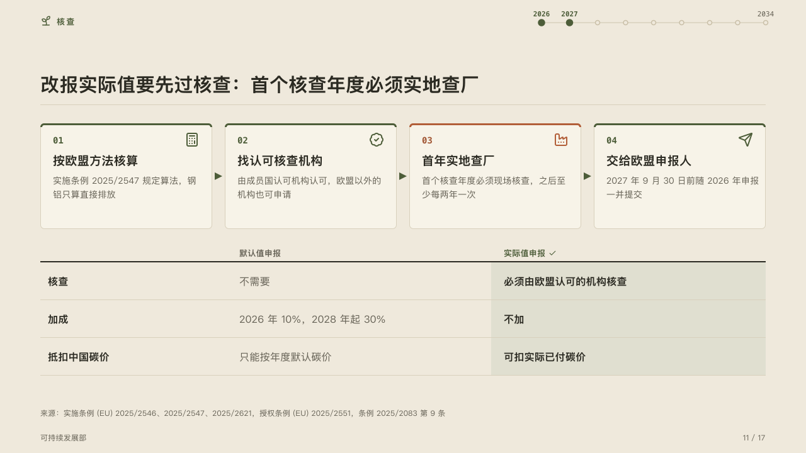

# procedure

What has to be done, in order, over the table that says what doing it changes.

Code: [`src/layouts/compositions/procedure.tsx`](../../../src/layouts/compositions/procedure.tsx). The header comment there is the contract. The yearbook setting only.

## almanac, CBAM sample, 2026-10

Settled on the verification page (p11). The round's decisions are in [rounds/2026-10-05-almanac](../../rounds/2026-10-05-almanac/README.md).

| board (p11) | engine |
| :-: | :-: |
|  |  |

**What it looks like.** The steps stand as cards in a row with small arrowheads in the mark between them: each its number in mono and its icon at the top right, its title bold and its text muted, a 3px top edge. The step the page turns on (its title written `**…**`) takes the accent for its edge, its number and its icon, the others take the mark. Under the steps an open table under a 2px rule of ink: the rows' names bold, the two options' cells, the option the page recommends on the mark's tint, bold, a check after its header.

**Why.** Verification is a sequence with one costly step, the first year's site visit, and its whole point is the column it unlocks: no markup, and the carbon price actually paid.

**What it gave up.**

- A `steps` of two to five items, then a `comparison` of two columns with one recommended and two to five rows, no row icon, tag or mark.
- A title past one line, text past three lines, a cell past one line of its column, or anything taller than the band sends the page back.
