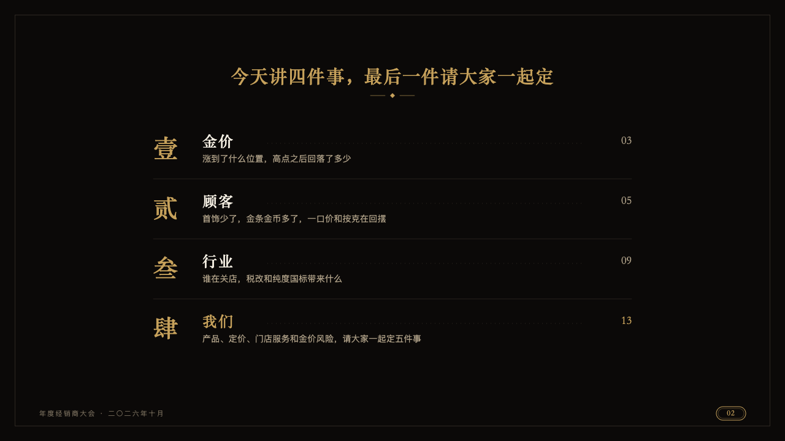
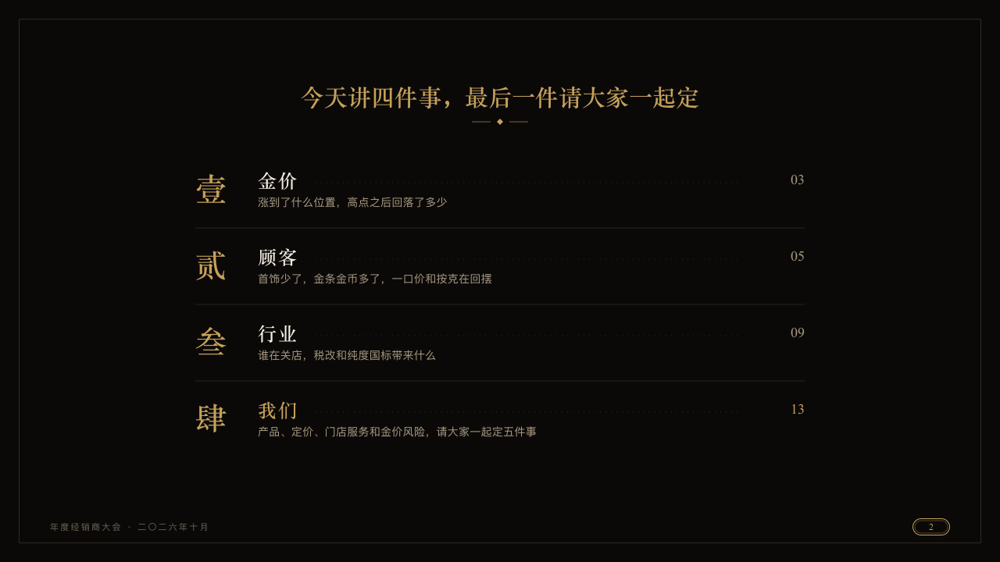

# programme

A gala's order of the day: each part numbered large, its name, what it covers and a dotted leader to the page it opens on.

Code: [`src/layouts/compositions/programme.tsx`](../../../src/layouts/compositions/programme.tsx). The header comment there is the contract. The invitation setting only.

## luxe, gold dealer conference sample, 2026-10

Settled on p02. The round's decisions are in [2026-10-08-luxe](../../rounds/2026-10-08-luxe/README.md).

| board (p02) | engine |
| :-: | :-: |
|  |  |

**What it looks like.** The claim centred over the page. Each item on a line of its own: its numeral at 40px in the heading serif in gold (壹 贰 叁 肆 in a Chinese deck, I II III IV in any other), its name at 24px in the serif tracked 2px, a dotted leader in the hairline ink running from the name to the page the item opens on (the item's `sub`) at 18px in the serif at the right, and under the name what it covers at 14px in old gold. A hairline between items. The item the author marks (`emphasis`) has its name and its page in gold.

**Why.** An invitation's programme tells guests what the evening holds and where each part begins. Numerals in the formal hand read as the house's own.

**What it gave up.**

- Takes one `numbered_cards` of three to five items with no icon.
- A name, a line or a page past its room, or more than five items, sends the page back.
