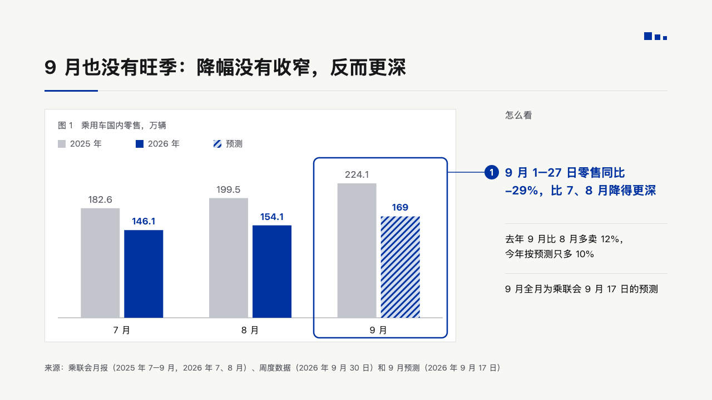
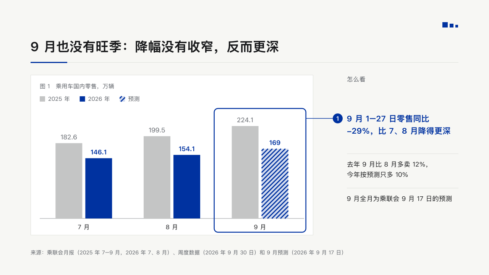
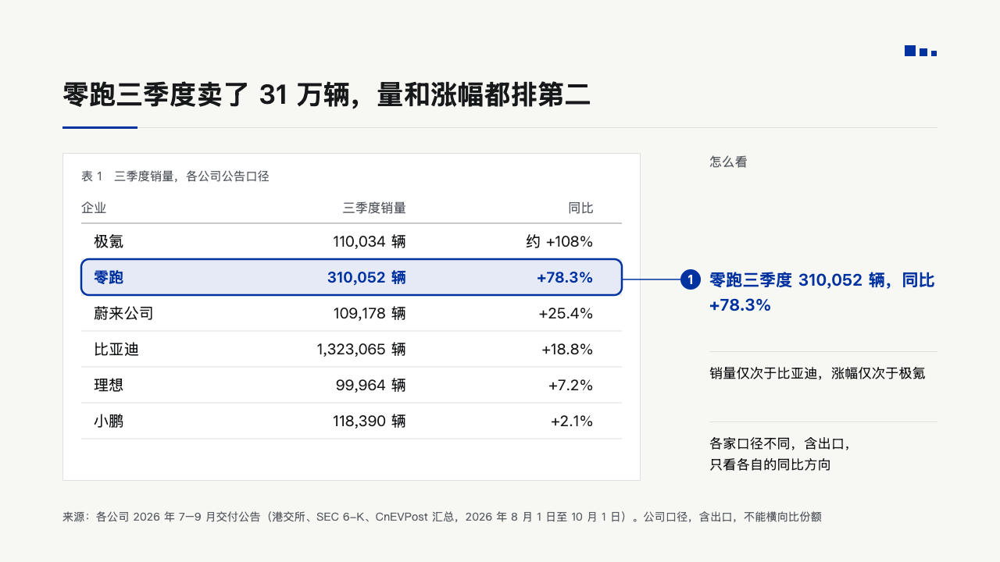
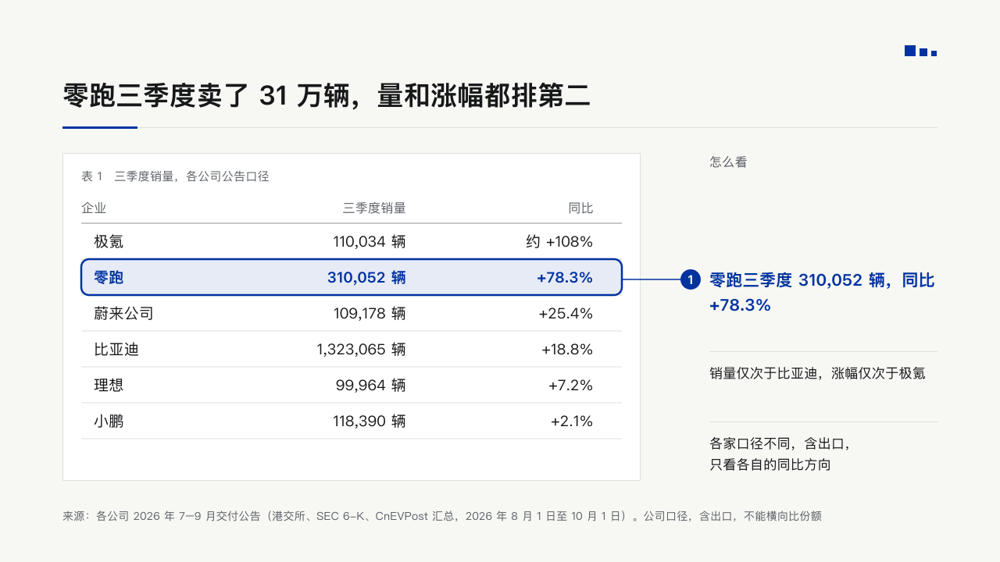
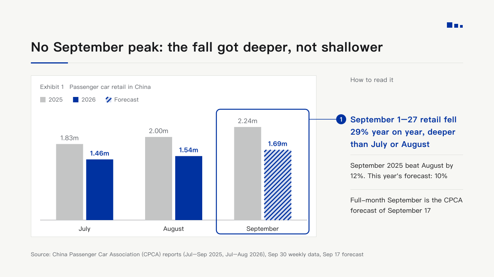

# proof

One exhibit on a white card, a ring round the place in it that proves the claim, and the reading beside it numbered to the ring.

Code: [`src/layouts/compositions/proof.tsx`](../../../src/layouts/compositions/proof.tsx). The header comment there is the contract. The notice setting only.

## bulletin, kinds round, 2026-10

Settled on the evidence pages p05, p06 and p09. The round's decisions are in [rounds/2026-10-09-bulletin-kinds](../../rounds/2026-10-09-bulletin-kinds/README.md).

| board | engine |
| :-: | :-: |
|  |  |
|  |  |
|  |  |

**What it looks like.** A 740 by 420 white card from (80, 196) with a hairline edge. Its caption at 15/22 muted: the number 「图 1」, 「表 1」 or "Exhibit 1", a full-width space, the title, and for a chart the unit its values do not carry (「，万辆」). A chart: the legend at y252 (14px swatches, 15px names, a hatched swatch for a forecast), bars 70px wide 8px apart standing on y572 at most 270px tall, no value axis, every value 10px over its bar at 17px, the marked series bold in IKB and the other in the receded grey, categories at 16px under the baseline. A table: headers at 16px muted on y272 over a rule at y286, 46px rows at 19px with a hairline under each, the highlighted row bold IKB on the pale IKB tint. The ring is a 2.5px IKB rounded rectangle: round the marked bar's whole category, 46px clear of the bars on each side, from 18px over the plot to 36px under the baseline, or round the highlighted row. A 1.5px leader runs level from the ring to a 13px IKB disc with a white 「1」 at x884. From x908: 「怎么看」 ("How to read it") at 16/22 muted on y196, the reading at 21/32 bold IKB level with the disc, and up to three notes at 17/27 each under a hairline, 90px apart.

**Why.** An evidence page says where to look. The ring and the number tie the sentence on the right to the exact bars or row on the left.

**What it gave up.**

- A titled upright bar chart of one or two series over two to five categories with one marked bar (`data[].emphasis`), or a titled `data_table` of two to four columns and up to six rows with one highlighted row. Then one `paragraph`, the reading, and up to three notes as paragraphs or one `bullets`.
- The reading rises to fit when the ring sits low. When the disc can no longer stand level with the ring the page goes to the notice sheet.
- The marked bar says where the ring goes. The chart schema refuses a marked bar beside a marked series, so the marked bar's series is the one set in IKB.
