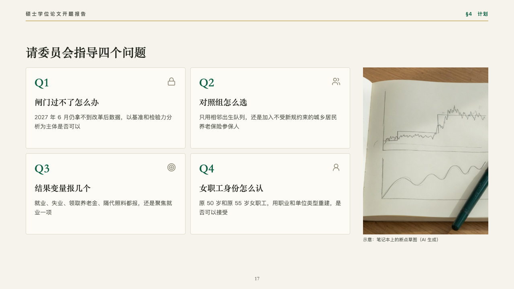
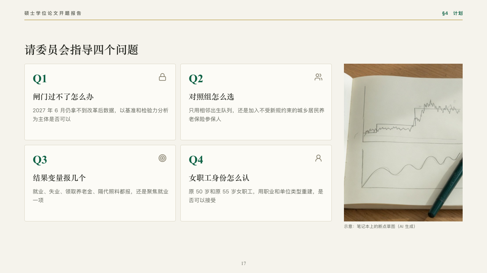

# queries

Questions put to a committee.

Code: [`src/layouts/compositions/queries.tsx`](../../../src/layouts/compositions/queries.tsx). The header comment there is the contract. The manuscript setting only.

## thesis, retirement age thesis proposal sample, 2026-10

Settled on the questions for the committee (p17). The round's decisions are in [rounds/2026-10-06-thesis](../../rounds/2026-10-06-thesis/README.md).

| board (p17) | engine |
| :-: | :-: |
|  |  |

**What it looks like.** A card a question in two columns: its label set large in emerald in the heading serif (「Q1」), its icon in pebble at the top right, the question in the heading serif and what it hangs on under it in the grey. A photograph at the right with its plain caption.

**Why.** A proposal defense ends by asking for guidance. Four numbered questions with what each decision depends on give the committee something to answer.

**What it gave up.**

- Takes an `icon_cards` of two to four titled 「label：question」, then an `image`.
- A label wider than 120px, a question past one line or what it hangs on past three lines sends the page back.
