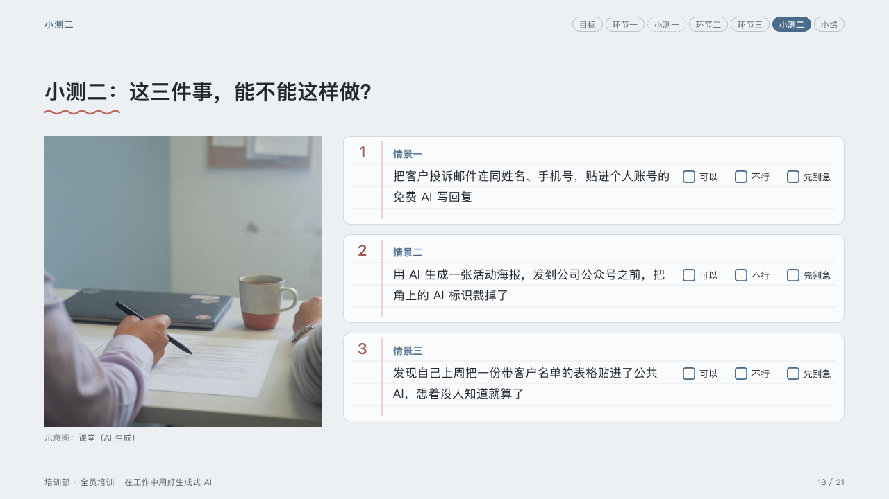

# quiz

Questions for the room, each with a box for every answer it may give.

Code: [`src/layouts/compositions/quiz.tsx`](../../../src/layouts/compositions/quiz.tsx). The header comment there is the contract. The lesson setting only.

## homeroom, AI-at-work training sample, 2026-10

Settled on the two quiz pages (p09, p18). The round's decisions are in [rounds/2026-10-06-homeroom](../../rounds/2026-10-06-homeroom/README.md).

| board (p09) | engine |
| :-: | :-: |
|  |  |

| board (p18) | engine |
| :-: | :-: |
|  |  |

**What it looks like.** A photograph of the class at the left, 400 by 420, its caption under it, and beside it each question on a card of ruled paper with a red margin 56px in: its number in the pen in the margin, its case bold in the mark (「情景一」), the case at 17/30, and at its right a box for each of the page's `ballot` choices with the choice beside it. Each choice takes 74px, more when its word is longer.

**Why.** A quiz asks the room to commit before the answer: the boxes are there to be ticked on paper or by a show of hands.

**What it gave up.**

- A page with a `ballot` of two to four choices: optionally an `image`, then a `row_cards` of two to four cases with a title and a text.
- The rules fall every 32px just under each line of writing (41, 73 and 105px down the card), 4px clear of its descenders, and the number stands on the case name's baseline. The board ruled at 32, 64 and 96 through the words and the number; the design brief keeps every rule 4px clear of text.
- A page with a ballot is offered to this composition alone; the sheet declares the ballot dropped when the quiz does not take the page.
