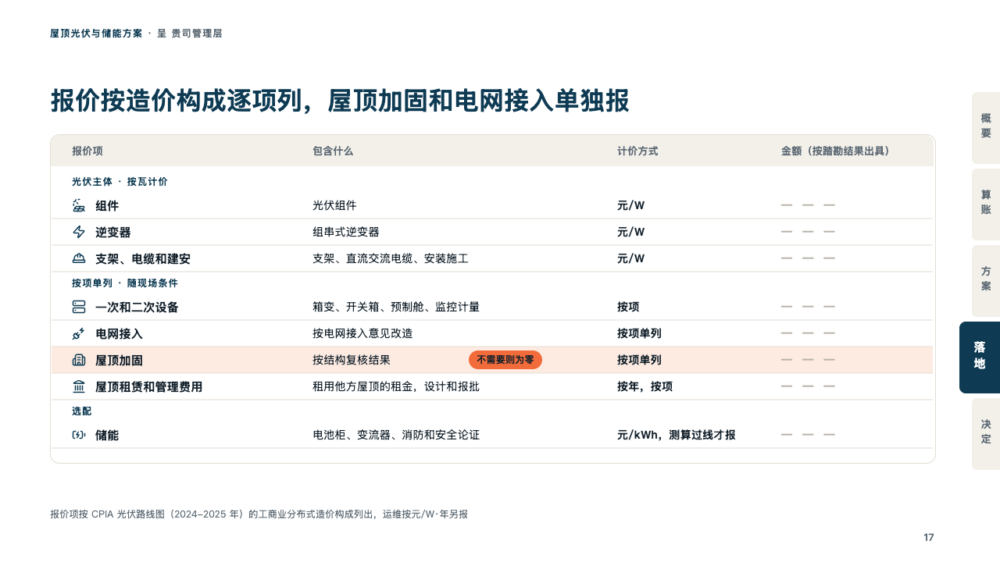
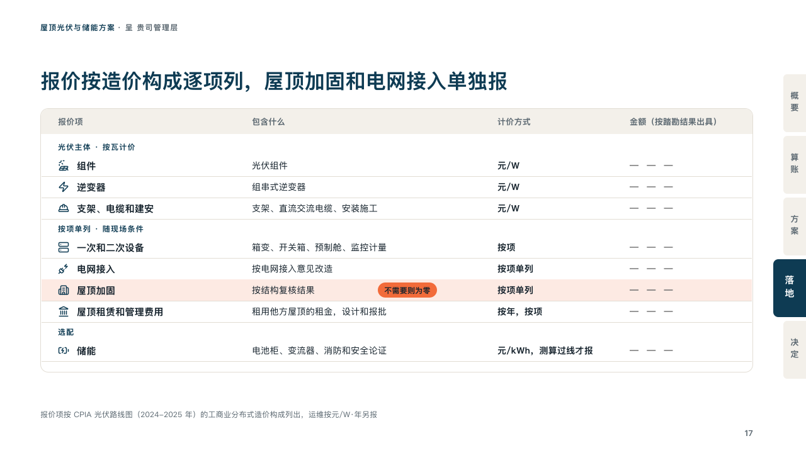

# quote

A price list set as one sheet, with the amounts left to fill after the survey.

Code: [`src/layouts/compositions/quote.tsx`](../../../src/layouts/compositions/quote.tsx). The header comment there is the contract. The binder setting only.

## proposal, rooftop solar and storage proposal sample, 2026-10

Settled on the pricing page (p17). The round's decisions are in [rounds/2026-10-06-proposal](../../rounds/2026-10-06-proposal/README.md).

| board (p17) | engine |
| :-: | :-: |
|  |  |

**What it looks like.** One framed sheet with its column headers on a band of sand, then each table a group: its title as a small tracked line in petrol, its rows under it, each with its icon in petrol, its item bold, what it covers, how it is priced bold and its amount. An amount still to be set (「— — —」) is a blank to fill in a grey with air between the dashes. The row the page leads with sits on the tangerine's tint, its tag a chip of the tangerine after what it covers.

**Why.** A quote before a survey cannot have prices. Listing every line by the industry's own cost breakdown, with the blanks left visibly blank, shows what the price will be made of and that nothing is hidden.

**What it gave up.**

- Takes two to four `data_table`s, each with a title, the same three or four columns and one to five rows, each row with an icon, a tag only on the one row marked `highlight`, eight rows at most in all.
- The blanks are a grey that reads at 4.5:1. The board's paler dashes read at 2:1.
- Tables whose columns differ, a cell past its column, a group title past one line or a sheet taller than the band sends the page back.
