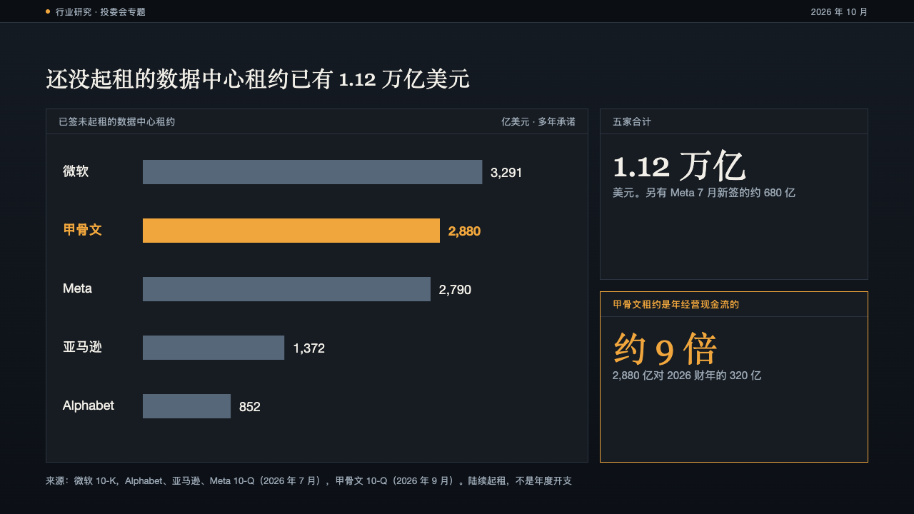
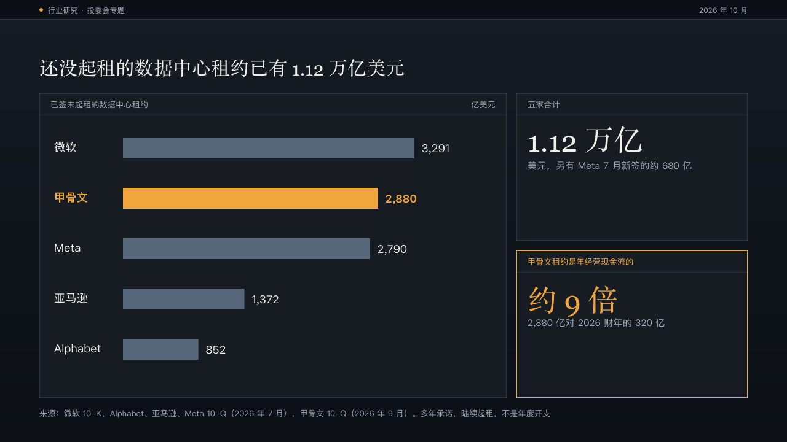
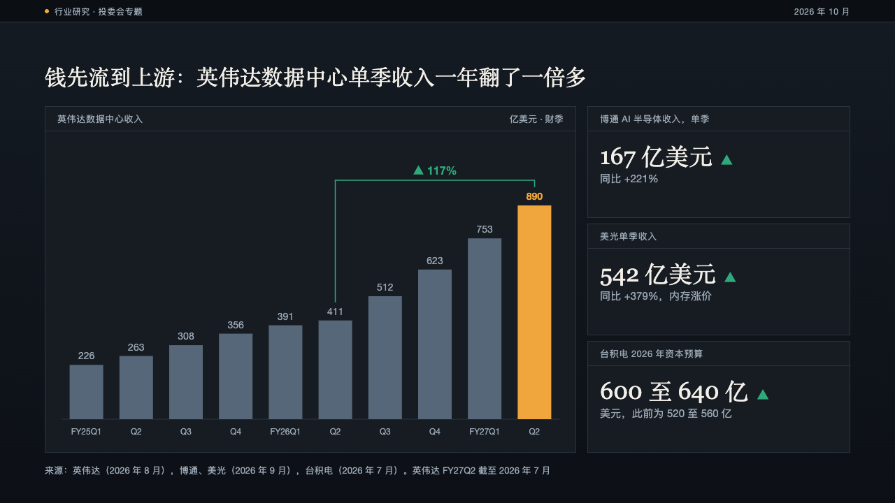
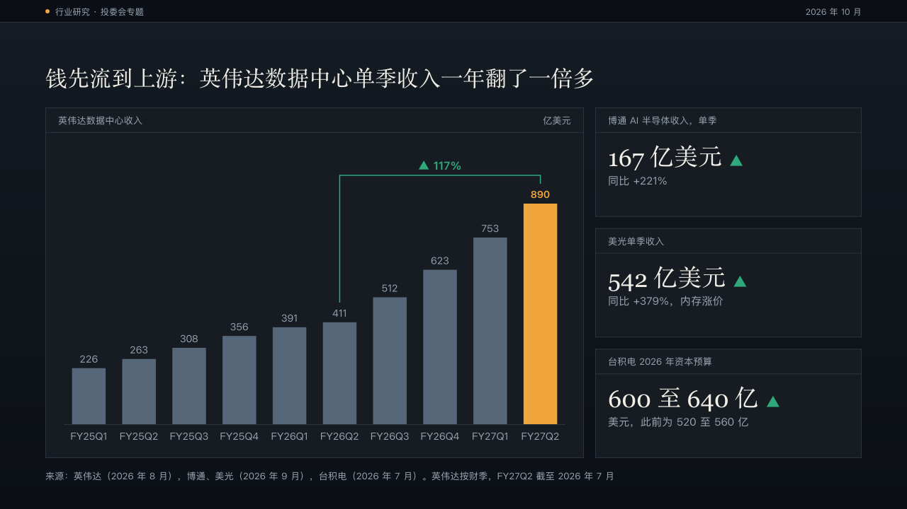
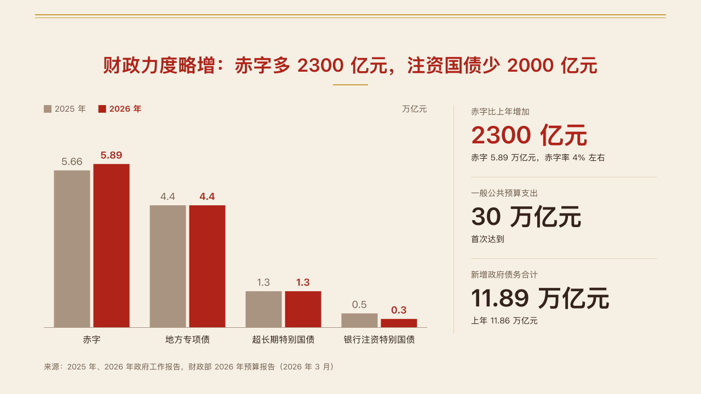
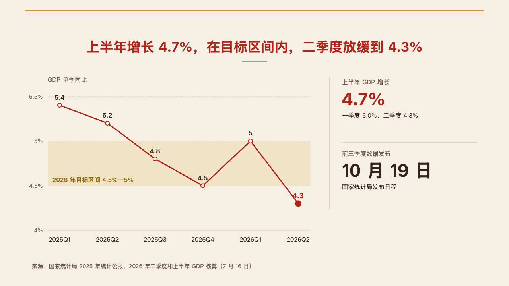
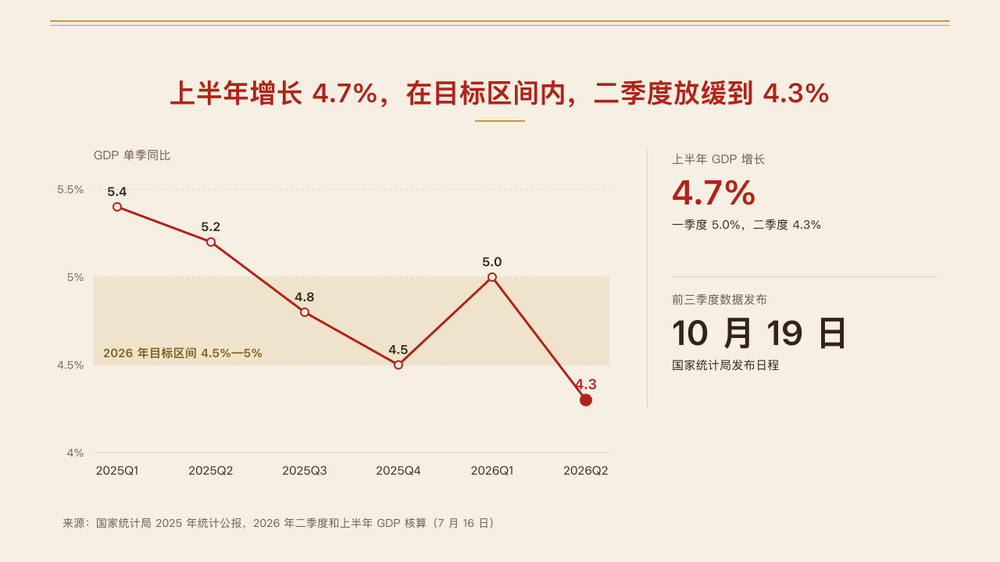

# rail

A trend chart with a column beside it that states what each series did from its first value to its last.

Code: [`src/layouts/compositions/rail.tsx`](../../../src/layouts/compositions/rail.tsx). The header comment there is the contract.

## brief, 2026-10

| board (p03) | engine |
| :-: | :-: |
|  |  |

**What it looks like.** The chart keeps the left of the band. A hairline stands 280px from the right edge, and the column right of it has one block per series: the series' swatch and name small and muted, the change as a whole-number percentage in the heading font (56px, stepping down to 44 or 36 when three series need the room), and "first → last" in the axis unit. A series whose axis is in percent changes by points instead: "+10.9 pts", or 「+10.9 个百分点」 on a chart written in Chinese, to one decimal, with the unit set smaller and muted beside the figure. The marked series (`series[].emphasis`) sets its change in primary over the theme's highlight. The others recede to muted.

**Why.** A trend page's headline is a pair of percentages. Computing them from the series means the column can never disagree with the chart, and the author never writes a number twice.

**What it gave up.**

- The column is derived, not written. Change is (last − first) / first, except on a percent axis, where it is last − first in points (maintainer's call, 2026-10-02: 80.1% to 91.0% used to print +14%, which reads as the rate itself moving fourteen points). The figure's language follows the chart's own words: its series names, categories and axis titles.
- One to three series on a category axis, each starting above zero unless its axis is in percent. Anything else, or a chart that would drop content in the narrower plot, goes back to the face and draws at full width with no column.
- The board's unmarked bars were a pale grey (#C9CCD2). The engine uses one that clears 3:1 against the page, so the bars still read as data.

## brief, tea sample, 2026-10

| board (p03) | engine |
| :-: | :-: |
|  |  |

| board (p07) | engine |
| :-: | :-: |
|  |  |

**What changed.** A chart page whose author writes the figures it is about gets them in the column instead of the computed changes. The page is a `chart` followed by one or two `kpi_cards` items, and optionally a closing `callout` or a `blockquote`. The column moves out to a hairline at x872, and each block is a 16px muted label, the figure at 52px in primary, and a `note` at 17px in body ink within two lines, 200px apart with a hairline between them. The first figure sits over the theme's emphasis stroke. A quote closes the column at 20/32 in primary under its attribution, set as the block's label. A callout closes it the same way with no label line.

**Why.** On a real deck the figure the page is about is often not a change between the chart's first and last bar. p03's chart shows openings and closures, and the page is about the net loss and how it compares with the year before. Only the author knows those numbers, so the author writes them, and nothing in the column is computed.

**What it gave up.**

- The two columns are drawn by the same composition with two geometries: the first round's for computed changes, this round's for written figures. A chart alone keeps the first.
- A figure with a delta arrow, an icon or a source line has no place in the column, and three figures, or two and a remark, do not fit its height. The page then goes back to the face.
- The first figure's highlight is a fixed mark of the column, because a `kpi_cards` value carries no `**…**` marks.

## bulletin, NEV sample, 2026-10

The notice setting. The plot is no longer the chart component: `rail` hands the left of the band to [`columns`](../columns/), [`bars`](../bars/) or [`bridge`](../bridge/) and sets the author's `kpi_cards` in the column right of a hairline ([rail-figures.tsx](../../../src/layouts/compositions/rail-figures.tsx), `railFiguresNotice`). See the boards in those three folders. The round's decisions are in [rounds/2026-10-03-bulletin](../../rounds/2026-10-03-bulletin/README.md).

**What it looks like.** The column starts 420px from the right edge behind a hairline. Up to three figures, 170px apart with a hairline between them: a 16px muted label, the value at 50px bold, and a 16px note in body ink under it within two lines. A figure whose value is wrapped in `**…**` is primary.

**Why.** The board put the figures that state the page's claim next to the chart that shows it, and the chart then needs no axis to be read.

**What it gave up.**

- A `kpi_cards` with a note no longer sends the page to a plainer face: the note is part of the figure.
- A full-body `waterfall` may share the page with `kpi_cards` on a face that says so (`fullBodyCompanions`). validate still refuses any other sibling.

## swiss, power sample, 2026-10

The figure column beside [`columns`](../columns/) on p05 and p13 and beside the short chart under [`share`](../share/) on p08, in the grid setting. See those pages' boards. The round's decisions are in [rounds/2026-10-03-swiss](../../rounds/2026-10-03-swiss/README.md).

**What it looks like.** A 1px black rule at x800, the plot to x760, the column from x840: a 16px muted label, the figure bold at 52px, its note at 16px, 170px apart. The figure written `**…**` is in the accent. In a band too short for that (under a share bar) each figure steps down to 44px with its note beside it in up to two lines, 110px apart, on the board's shorter column: the rule at x780, the plot to x700, the column from x820.

## ledger, AI capex sample, 2026-10

In the panel setting, settled on three pages: the guidance page (its dot plot in [compositions/shifts](../shifts/)), the lease page and the supplier page. The round's decisions are in [rounds/2026-10-04-ledger](../../rounds/2026-10-04-ledger/README.md).

| board (p09) | engine |
| :-: | :-: |
|  |  |

| board (p11) | engine |
| :-: | :-: |
|  |  |

**What it looks like.** A chart in its panel beside a column of figure panels, one per `kpi_cards` item. The column stands on the side the author wrote it: figures before the chart on the left (360px), after it on the right (376px). Each figure panel is named by the item's label and sets the figure at the largest of 56, 48, 40 and 34px its panel holds, an arrow after it for its `delta` in the direction's colour, and its unit and note under it at 15px. A marked figure takes amber for its panel's edge, its name and itself. The chart is any chart the panel setting draws: columns, a stack, a combo, horizontal bars or a dumbbell.

**Why.** Each of these pages argues from one chart and two or three figures that qualify it. Panels of one size make the figures read as a column of quotes beside the chart.

**What it gave up.**

- One to three figures. A figure its panel cannot hold whole declines the page to the other compositions.
- The bars on the lease page set each name on the left at 18px and the value after the bar, the marked bar in amber with its name and value bold.

## vermilion, government work report sample, 2026-10

The seal setting's form, in [`rail-seal.tsx`](../../../src/layouts/compositions/rail-seal.tsx), with the plots in [`plot-seal.tsx`](../../../src/layouts/compositions/plot-seal.tsx). The round's decisions are in [rounds/2026-10-04-vermilion](../../rounds/2026-10-04-vermilion/README.md).

| board (p05) | engine |
| :-: | :-: |
|  |  |

| board (p09) | engine |
| :-: | :-: |
|  |  |

**What it looks like.** An upright `chart` followed by a `kpi_cards` of one to three plain figures (no delta, icon, source or tag). The figures stand in a 340px column on the right past a hairline, up to 180px apart: the label at 15px, the figure bold at 44px (38 or 32 when it does not fit, in the mark when marked) and the note at 15/22. The plot fills the rest: grouped columns (`columns`' seal form) on the fiscal page, one line over a marked range (`trend`) on the growth page, and any other chart by the component renderer.

**Why.** A chart's few headline figures are what the room takes away. Standing them beside the plot keeps both on one page.
