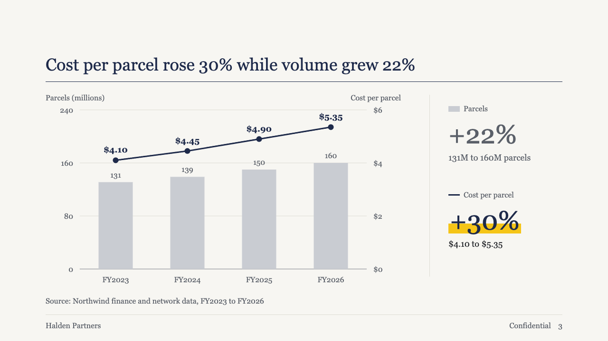
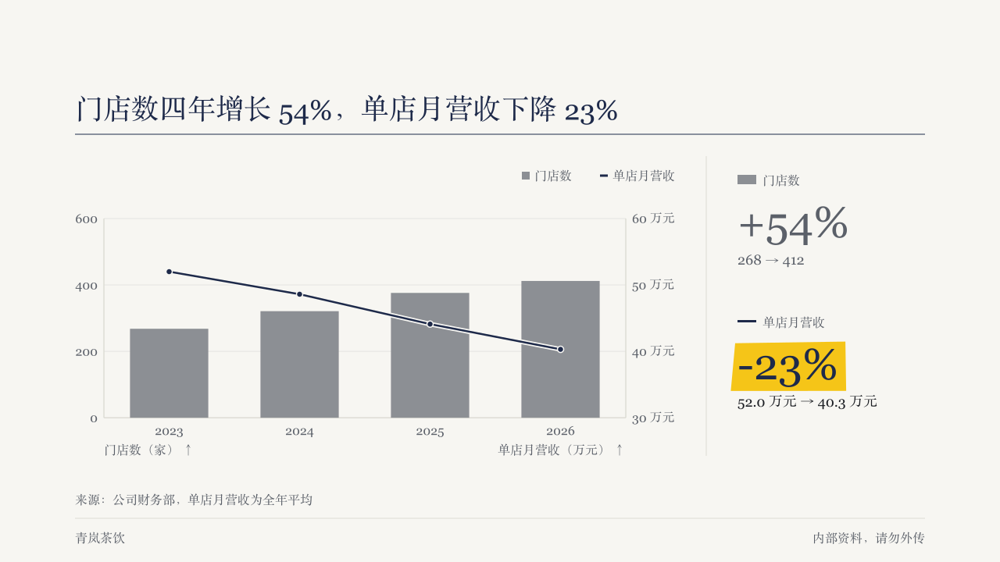
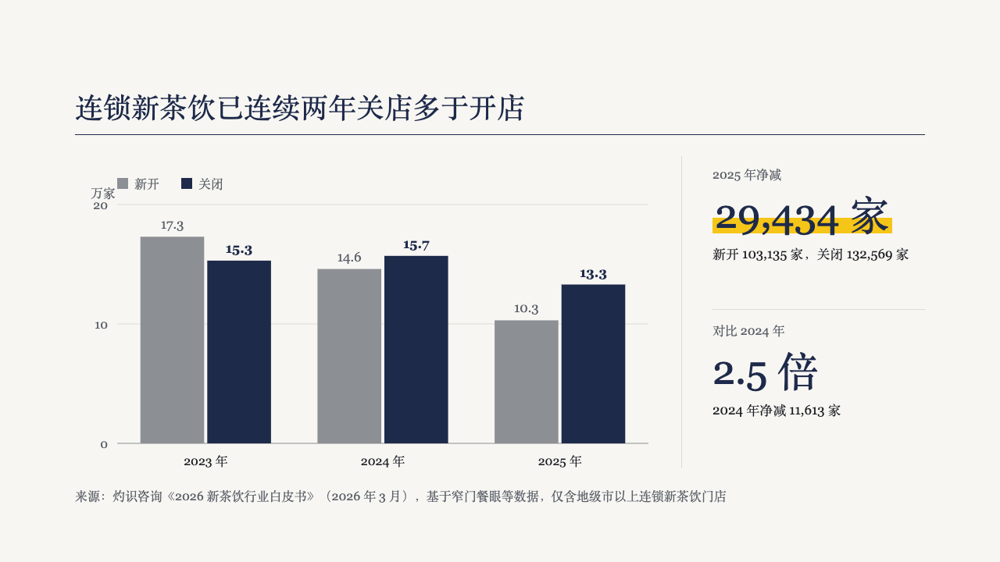
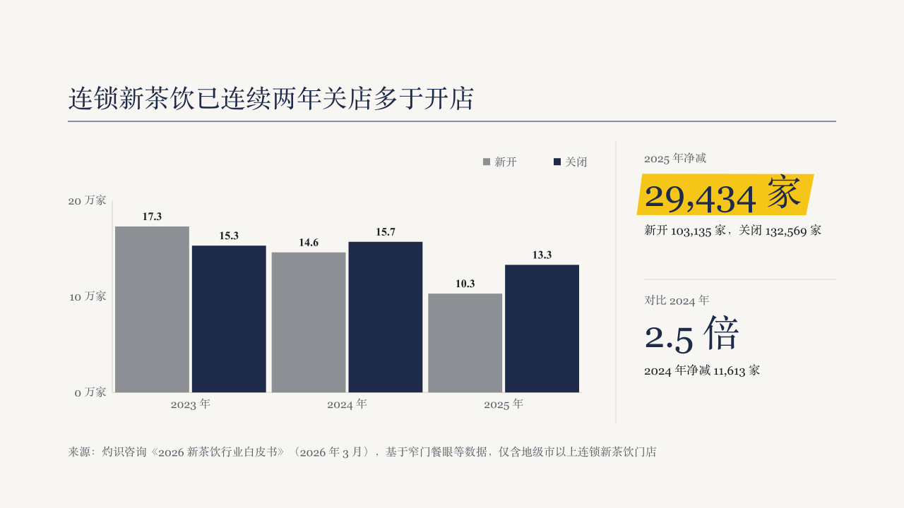
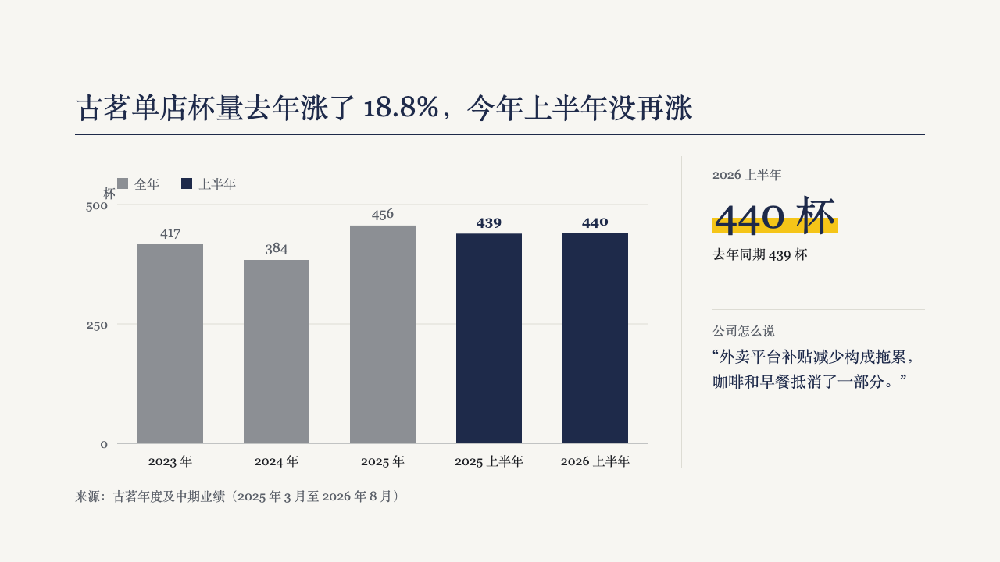
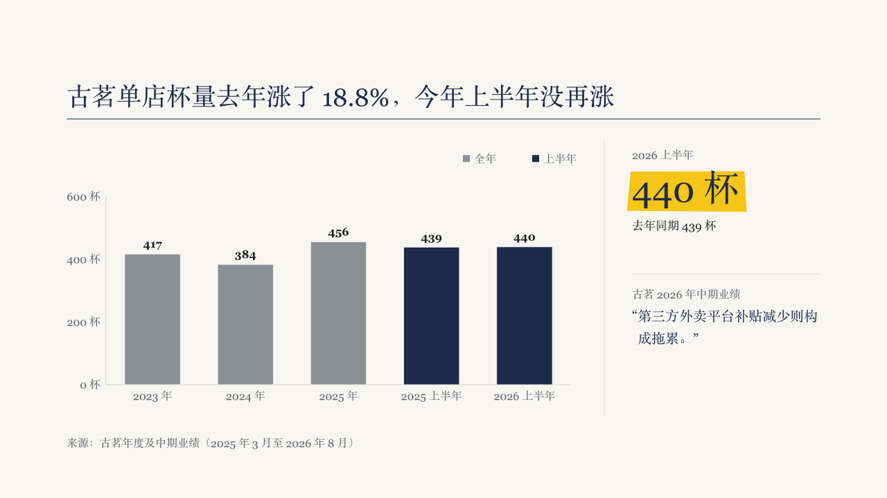

# rail

A trend chart with a column beside it that states what each series did from its first value to its last.

Code: [`src/layouts/compositions/rail.tsx`](../../../src/layouts/compositions/rail.tsx). The header comment there is the contract.

## brief, 2026-10

| board (p03) | engine |
| :-: | :-: |
|  |  |

**What it looks like.** The chart keeps the left of the band. A hairline stands 280px from the right edge, and the column right of it has one block per series: the series' swatch and name small and muted, the change as a whole-number percentage in the heading font (56px, stepping down to 44 or 36 when three series need the room), and "first → last" in the axis unit. A series whose axis is in percent changes by points instead: "+10.9 pts", or 「+10.9 个百分点」 on a chart written in Chinese, to one decimal, with the unit set smaller and muted beside the figure. The marked series (`series[].emphasis`) sets its change in primary over the theme's highlight. The others recede to muted.

**Why.** A trend page's headline is a pair of percentages. Computing them from the series means the column can never disagree with the chart, and the author never writes a number twice.

**What it gave up.**

- The column is derived, not written. Change is (last − first) / first, except on a percent axis, where it is last − first in points (maintainer's call, 2026-10-02: 80.1% to 91.0% used to print +14%, which reads as the rate itself moving fourteen points). The figure's language follows the chart's own words: its series names, categories and axis titles.
- One to three series on a category axis, each starting above zero unless its axis is in percent. Anything else, or a chart that would drop content in the narrower plot, goes back to the face and draws at full width with no column.
- The board's unmarked bars were a pale grey (#C9CCD2). The engine uses one that clears 3:1 against the page, so the bars still read as data.

## brief, tea sample, 2026-10

| board (p03) | engine |
| :-: | :-: |
|  |  |

| board (p07) | engine |
| :-: | :-: |
|  |  |

**What changed.** A chart page whose author writes the figures it is about gets them in the column instead of the computed changes. The page is a `chart` followed by one or two `kpi_cards` items, and optionally a closing `callout` or a `blockquote`. The column moves out to a hairline at x872, and each block is a 16px muted label, the figure at 52px in primary, and a `note` at 17px in body ink within two lines, 200px apart with a hairline between them. The first figure sits over the theme's emphasis stroke. A quote closes the column at 20/32 in primary under its attribution, set as the block's label. A callout closes it the same way with no label line.

**Why.** On a real deck the figure the page is about is often not a change between the chart's first and last bar. p03's chart shows openings and closures, and the page is about the net loss and how it compares with the year before. Only the author knows those numbers, so the author writes them, and nothing in the column is computed.

**What it gave up.**

- The two columns are drawn by the same composition with two geometries: the first round's for computed changes, this round's for written figures. A chart alone keeps the first.
- A figure with a delta arrow, an icon or a source line has no place in the column, and three figures, or two and a remark, do not fit its height. The page then goes back to the face.
- The first figure's highlight is a fixed mark of the column, because a `kpi_cards` value carries no `**…**` marks.
