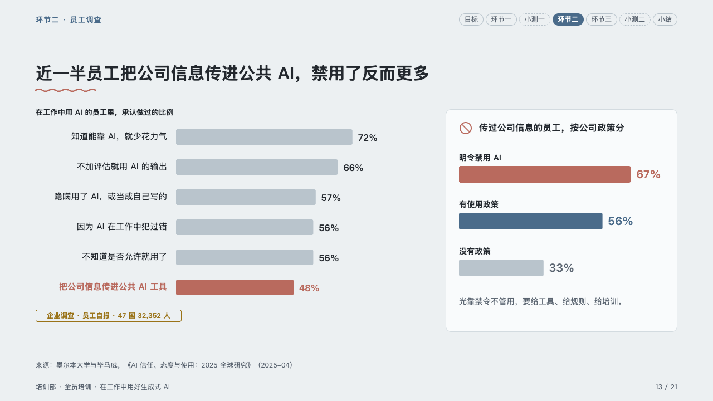
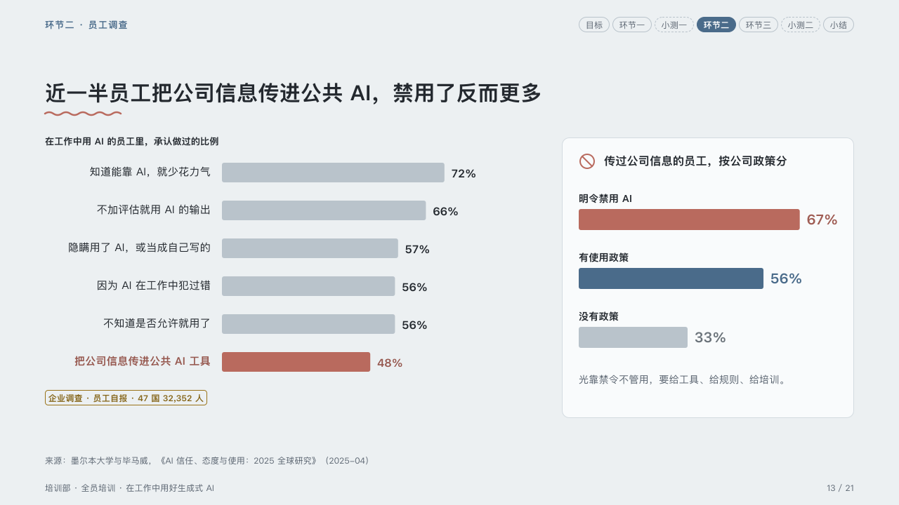

# ranking

How many do each thing, and one of them broken down.

Code: [`src/layouts/compositions/ranking.tsx`](../../../src/layouts/compositions/ranking.tsx). The header comment there is the contract. The lesson setting only.

## homeroom, AI-at-work training sample, 2026-10

Settled on the risky habits page (p13). The round's decisions are in [rounds/2026-10-06-homeroom](../../rounds/2026-10-06-homeroom/README.md).

| board (p13) | engine |
| :-: | :-: |
|  |  |

**What it looks like.** On the left the share who do each thing, under the chart's axis title: names right-aligned at x300 (further right when a name is longer), bars 4.4px a percentage point, every bar in the ghost but the one the page is about, in the pen with its name and figure; the kind of survey as a pill under the bars. On the right a card breaks the marked habit down: the callout's icon in the pen and its title bold, the second chart's bars each under its name, the marked one in the pen and the others stepping in the order written from the mark to the ghost, and the callout's words muted at its foot.

**Why.** The page's point is one bar and its breakdown: the ranking sets its context, the card its consequence.

**What it gave up.**

- A horizontal bar `chart` of three to six bars, a `callout` with a title, and a second horizontal bar `chart` of two to four bars.
- A name past its column, a figure past the plot, a card title past one line or its words past two sends the page back.
